<!--
* Notes
    - add [MultiQC](http://multiqc.info/)
    - change grch38/hg38
    - incorporate other pipeline (ChIP-seq, WGBS, WGS/WXS)
    - Docker + WDL/CWL
-->


## <a name="Top"/>


## CRI RNAseq Pipelines
- [CRI-RNAseq-2016](https://github.com/riyuebao/CRI-Workshop-Nov2016-RNAseq/blob/master/Run_RNAseq.tutorial.ipynb) by [Riyue Bao](http://cri.uchicago.edu/people/#bao). Last modified on **November 12, 2016**.
- [CRI-RNAseq-2014](https://wiki.uchicago.edu/pages/viewpage.action?pageId=95855827) by [Lei Huang](http://cri.uchicago.edu/people/#huang). Last modified on **Apr 29, 2014**.


## **<span style="color:red">RUN AS PRACTICE</span>**

> 
> 
> This tutorial of RNA-seq analysis pipeline is all designed based on the HPC environment in CRI.
> Any changes on the metadata file (i.e., <span style="color:red">```example/DLBC/DLBC.metadata.txt```</span>) will be
> considered as not running for practice and should expect the results not be the same as shown here.
> 
> 

> 
> **Pipeline package is available on <span style="color:red">[GitHub](https://github.com/wenching/cri_rnaseq_2018)</span>**
> 

The [Center for Research Informatics](http://cri.uchicago.edu/) (CRI) provides computational resources and expertise in biomedical informatics for researchers in the Biological Sciences Division (BSD) of the University of Chicago. 

<!--
This workshop is part of a series of [monthly training events](http://cri.uchicago.edu/seminar-series/) focusing on using the University of Chicago’s computational resources to analyze Next-Generation Sequencing and Microarray data.
-->

As a [bioinformatics core](http://cri.uchicago.edu/bioinformatics/), we are actively improving our pipelines and expanding pipeline functions. The tutorials will be updated in a timely manner but may not reflect the newest updates of the pipelines. Stay tuned with us for the latest pipeline release.

If you have any questions, comments, or suggestions, feel free to contact our core at bioinformatics@bsd.uchicago.edu or one of our bioinformaticians.

* [Introduction](#Intro)
* [Work Flow](#Work)
* [Data Description](#Data)
* [Prerequisites](#Pre)
    + [Login and Setup Tutorial Working Directory](#Login)
* [Pipeline Steps](#Steps)
    + Step 1: [Quality Control](#ReadQC)
    + Step 2-1: [Read Alignment](#Aln)
    + Step 2-2: [Alignment QC](#AlnQC)
    + Step 3: [Expression Quantification](#Quant)
    + Step 4-1: [Identification of Differentially Expressed Genes (DEGs)](#DEG)
    + Step 4-2: [DEG Statistics](#LociStat)
    + Step 5: [Sample Correlation](#QuantQC)
    + Step 6: [Heat Map](#HeatMap)
    + Step 7: [Functional Enrichment Analysis](#GSEA)
* [BigDataScript Report](#BDS)
* [Reference](#Ref)


## <a name="Intro"/>Introduction | [Top](#Top)


RNA sequencing (RNA-seq) is a revolutionary approach that uses the next-generation sequencing technologies to detect and quantify expressed transcripts in biological samples. Compared to other methods such as microarrays, RNA-seq provides a more unbiased assessment of the full range of transcripts and their isoforms with a greater dynamic range in expression quantification.

In this tutorial, you will learn how to use the CRI's RNA-seq pipeline (available on both [CRI HPC cluster](http://cri.uchicago.edu/hpc/) and [GitHub](https://github.com/kmhernan/CRI_RNAseq_2018))) to analyze Illumina RNA sequencing data. The tutorial comprises the following Steps:

* Assess the sequencing data quality using [FastQC](https://www.bioinformatics.babraham.ac.uk/projects/fastqc/)
* Align the short reads to the target genome (e.g., Human) using [STAR](https://github.com/alexdobin/STAR)
* Measure alignment result using [Picard](https://broadinstitute.github.io/picard/) and [RSeQC](http://rseqc.sourceforge.net/)
* Quantify expression using [Subread](http://subread.sourceforge.net/)::[featureCounts](http://bioinf.wehi.edu.au/featureCounts/)
* Identify differentially expressed genes using [edgeR](https://bioconductor.org/packages/release/bioc/html/edgeR.html), [DESeq2](https://bioconductor.org/packages/release/bioc/html/DESeq2.html), [limma](https://bioconductor.org/help/search/index.html?q=limma/)
* Heat Map using [pheatmap](https://cran.r-project.org/web/packages/pheatmap/index.html)
* Conduct functional enrichment analysis using [clusterProfiler](https://bioconductor.org/packages/release/bioc/html/clusterProfiler.html)

By the end of this tutorial, you will:

* Understand the basics of RNA-seq experimental design
* Be familiar with the common data formats and standards in RNA-seq analysis
* Know computational tools for RNA-seq data processing
* Be able to align short sequence reads on a reference genome
* Be able to perform the basic analysis such as gene quantification and differential expression analysis

This tutorial is based on CRI's high-performance computing (HPC) cluster. If you are not familiar with this newly assembled cluster, a concise user's guide can be found [here](http://cri.uchicago.edu/wp-content/uploads/2017/04/Gardner-Part-1.pdf).


## <a name="Work"/>Work Folow | [Top](#Top)


The RNA-seq data used in this tutorial are from a [published paper](https://www.ncbi.nlm.nih.gov/pubmed/25499759) that explores *PRDM11* and lymphomagenesis.  
We will use the data from the PRDM11 knockdown and wild-type samples. You are welcome to explore the full dataset on GEO ([GSE56065](https://www.ncbi.nlm.nih.gov/geo/query/acc.cgi?acc=GSE56065)).

In this tutorial, we use a subset of the data focusing on chr11 in human as the example dataset.
The sample information are saved in the file **<span style="color:red">`DLBC.metadata.txt`</span>** (see [below](#Data)).

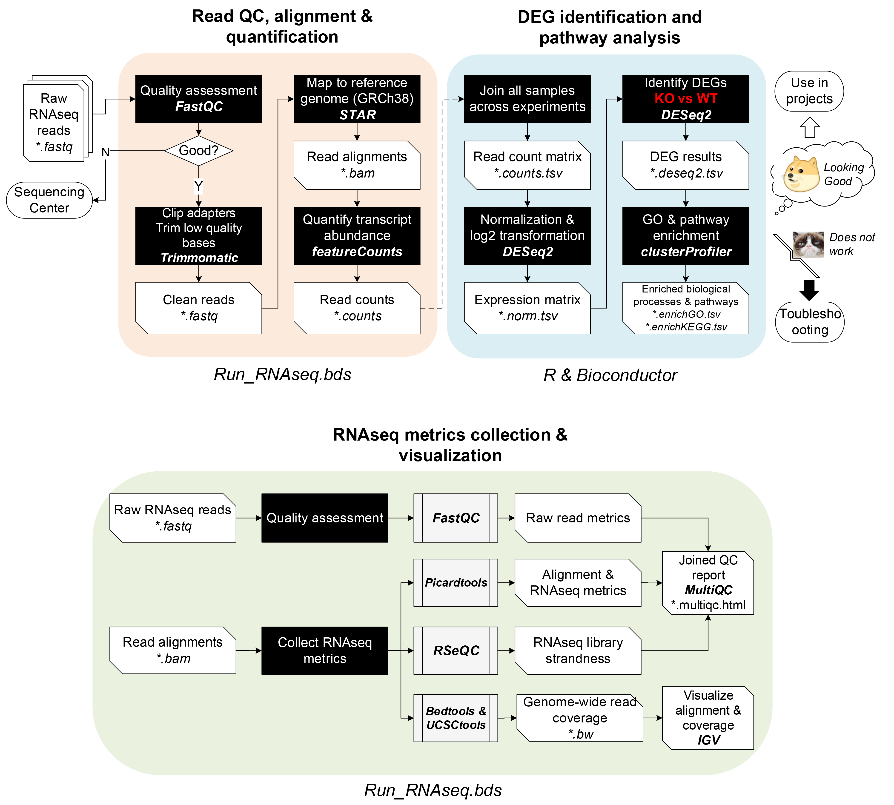


## <a name="Data"/>Data Description | [Top](#Top)

There are six (partial) single-end RNA-seq sequencing libraries will be used as the example dataset In this tutorial.
Their respective sample information is described in the metadata table example/**`DLBC.metadata.txt`**.


<div style="border: 1px solid #ddd; padding: 5px; overflow-y: scroll; height:300px; overflow-x: scroll; width:100%; "><table class="table table-striped table-hover table-condensed table-responsive" style="margin-left: auto; margin-right: auto;">
<caption>Sample Description</caption>
 <thead>
  <tr>
   <th style="text-align:left;"> Sample </th>
   <th style="text-align:left;"> Library </th>
   <th style="text-align:left;"> ReadGroup </th>
   <th style="text-align:left;"> LibType </th>
   <th style="text-align:left;"> Platform </th>
   <th style="text-align:left;"> SequencingCenter </th>
   <th style="text-align:left;"> Date </th>
   <th style="text-align:right;"> Lane </th>
   <th style="text-align:left;"> Unit </th>
   <th style="text-align:left;"> Flavor </th>
   <th style="text-align:right;"> Encoding </th>
   <th style="text-align:right;"> Run </th>
   <th style="text-align:left;"> Genome </th>
   <th style="text-align:left;"> NucleicAcid </th>
   <th style="text-align:left;"> Group </th>
   <th style="text-align:left;"> Location </th>
   <th style="text-align:left;"> Seqfile1 </th>
  </tr>
 </thead>
<tbody>
  <tr>
   <td style="text-align:left;"> KO01 </td>
   <td style="text-align:left;"> KO01 </td>
   <td style="text-align:left;"> SRR1205282 </td>
   <td style="text-align:left;"> NS </td>
   <td style="text-align:left;"> Illumina </td>
   <td style="text-align:left;"> SRA </td>
   <td style="text-align:left;"> 2015-07-22 </td>
   <td style="text-align:right;"> 7 </td>
   <td style="text-align:left;"> FCC2B5CACXX </td>
   <td style="text-align:left;"> 1x49 </td>
   <td style="text-align:right;"> 33 </td>
   <td style="text-align:right;"> 0 </td>
   <td style="text-align:left;"> grch38 </td>
   <td style="text-align:left;"> rnaseq </td>
   <td style="text-align:left;"> KO </td>
   <td style="text-align:left;"> /group/bioinformatics/CRI_RNAseq_2018/example/data </td>
   <td style="text-align:left;"> KO01.test.fastq.gz </td>
  </tr>
  <tr>
   <td style="text-align:left;"> KO02 </td>
   <td style="text-align:left;"> KO02 </td>
   <td style="text-align:left;"> SRR1205283 </td>
   <td style="text-align:left;"> NS </td>
   <td style="text-align:left;"> Illumina </td>
   <td style="text-align:left;"> SRA </td>
   <td style="text-align:left;"> 2015-07-22 </td>
   <td style="text-align:right;"> 7 </td>
   <td style="text-align:left;"> FCC2B5CACXX </td>
   <td style="text-align:left;"> 1x49 </td>
   <td style="text-align:right;"> 33 </td>
   <td style="text-align:right;"> 0 </td>
   <td style="text-align:left;"> grch38 </td>
   <td style="text-align:left;"> rnaseq </td>
   <td style="text-align:left;"> KO </td>
   <td style="text-align:left;"> /group/bioinformatics/CRI_RNAseq_2018/example/data </td>
   <td style="text-align:left;"> KO02.test.fastq.gz </td>
  </tr>
  <tr>
   <td style="text-align:left;"> KO03 </td>
   <td style="text-align:left;"> KO03 </td>
   <td style="text-align:left;"> SRR1205284 </td>
   <td style="text-align:left;"> NS </td>
   <td style="text-align:left;"> Illumina </td>
   <td style="text-align:left;"> SRA </td>
   <td style="text-align:left;"> 2015-07-22 </td>
   <td style="text-align:right;"> 7 </td>
   <td style="text-align:left;"> FCC2B5CACXX </td>
   <td style="text-align:left;"> 1x49 </td>
   <td style="text-align:right;"> 33 </td>
   <td style="text-align:right;"> 0 </td>
   <td style="text-align:left;"> grch38 </td>
   <td style="text-align:left;"> rnaseq </td>
   <td style="text-align:left;"> KO </td>
   <td style="text-align:left;"> /group/bioinformatics/CRI_RNAseq_2018/example/data </td>
   <td style="text-align:left;"> KO03.test.fastq.gz </td>
  </tr>
  <tr>
   <td style="text-align:left;"> WT01 </td>
   <td style="text-align:left;"> WT01 </td>
   <td style="text-align:left;"> SRR1205285 </td>
   <td style="text-align:left;"> NS </td>
   <td style="text-align:left;"> Illumina </td>
   <td style="text-align:left;"> SRA </td>
   <td style="text-align:left;"> 2015-07-22 </td>
   <td style="text-align:right;"> 4 </td>
   <td style="text-align:left;"> FCC2C3CACXX </td>
   <td style="text-align:left;"> 1x49 </td>
   <td style="text-align:right;"> 33 </td>
   <td style="text-align:right;"> 0 </td>
   <td style="text-align:left;"> grch38 </td>
   <td style="text-align:left;"> rnaseq </td>
   <td style="text-align:left;"> WT </td>
   <td style="text-align:left;"> /group/bioinformatics/CRI_RNAseq_2018/example/data </td>
   <td style="text-align:left;"> WT01.test.fastq.gz </td>
  </tr>
  <tr>
   <td style="text-align:left;"> WT02 </td>
   <td style="text-align:left;"> WT02 </td>
   <td style="text-align:left;"> SRR1205286 </td>
   <td style="text-align:left;"> NS </td>
   <td style="text-align:left;"> Illumina </td>
   <td style="text-align:left;"> SRA </td>
   <td style="text-align:left;"> 2015-07-22 </td>
   <td style="text-align:right;"> 4 </td>
   <td style="text-align:left;"> FCC2C3CACXX </td>
   <td style="text-align:left;"> 1x49 </td>
   <td style="text-align:right;"> 33 </td>
   <td style="text-align:right;"> 0 </td>
   <td style="text-align:left;"> grch38 </td>
   <td style="text-align:left;"> rnaseq </td>
   <td style="text-align:left;"> WT </td>
   <td style="text-align:left;"> /group/bioinformatics/CRI_RNAseq_2018/example/data </td>
   <td style="text-align:left;"> WT02.test.fastq.gz </td>
  </tr>
  <tr>
   <td style="text-align:left;"> WT03 </td>
   <td style="text-align:left;"> WT03 </td>
   <td style="text-align:left;"> SRR1205287 </td>
   <td style="text-align:left;"> NS </td>
   <td style="text-align:left;"> Illumina </td>
   <td style="text-align:left;"> SRA </td>
   <td style="text-align:left;"> 2015-07-22 </td>
   <td style="text-align:right;"> 4 </td>
   <td style="text-align:left;"> FCC2C3CACXX </td>
   <td style="text-align:left;"> 1x49 </td>
   <td style="text-align:right;"> 33 </td>
   <td style="text-align:right;"> 0 </td>
   <td style="text-align:left;"> grch38 </td>
   <td style="text-align:left;"> rnaseq </td>
   <td style="text-align:left;"> WT </td>
   <td style="text-align:left;"> /group/bioinformatics/CRI_RNAseq_2018/example/data </td>
   <td style="text-align:left;"> WT03.test.fastq.gz </td>
  </tr>
</tbody>
</table></div>


### Note

> 
> Column **LibType** can be "**NS**" for unstranded, "**RF**" for first strand, or "**FR**" for second strand.
> 
> You can read this [blog](http://onetipperday.sterding.com/2012/07/how-to-tell-which-library-type-to-use.html) for more details of strand-specific RNA-seq.
> 

> 
> For the persepctive of running as practice, here we use a subset of the human genome **`GRCh38.primary_Gencode24_50bp_chr11`** for Steps 1~4, and the complete information after [Step 5](#GSEA)
> 


## <a name="Pre"/>Prerequisites | [Top](#Top)


We will use SSH (Secure Shell) to connect to CRI's HPC. SSH now is included or can be installed in all standard operating systems (Windows, Linux, and OS X).


### <a name="Login"/>Login and Setup Tutorial Working Directory | [Top](#Top)


The login procedure varies slightly depending on whether you use a Mac/Unix/Linux computer or a Windows computer.

* Log into one of entry nodes in CRI HPC  
    1. Open a terminal session.  
    2. Connect to the login node of the CRI HPC cluster:  
        
        ```bash
        $ ssh -l username@gardner.cri.uchicago.edu
        ```
    3. If it's your first time to log in, you will be asked to accept the ssh key. Type "**yes**"  
    4. Type in the password when prompted  

        > Make sure that you replace **_<span style="color:red">`username`</span>_** with your login name.

* Set up a tutorial directory  
    1. Now you should be in your home directory after logging in  
        
        ```bash
        $ pwd
        /home/username
        ```
    2. Create a new directory (e.g., cri_rnaseq) under the home directory  
        
        ```bash
        $ mkdir cri_rnaseq
        $ cd cri_rnaseq
        ```

* Download the pipeline package  
    1. One way to download the pipeline package via `git clone`  
        
        ```bash
        $ git clone git@//github.com/wenching/cri_rnaseq_2018.git
        ```
    2. Or, you can use `wget` to download the pipeline package  
        
        ```bash
        $ wget https://github.com/wenching/cri_rnaseq_2018/archive/master.zip
        $ unzip master.zip
        $ mv cri_rnaseq_2018-master cri_rnaseq_2018
        ```
    3. Change working directory to pipeline dirctory  
        
        ```bash
        $ cd cri_rnaseq_2018
        $ tree -d
        |-- SRC
        |   |-- Python
        |   |   |-- lib
        |   |   |-- module
        |   |   `-- util
        |   `-- R
        |       |-- module
        |       `-- util
        |-- example
        |   |-- DLBC_full
        |   |   `-- RNAseq
        |   |       |-- DEG
        |   |       |   |-- deseq2
        |   |       |   |   `-- featurecounts
        |   |       |   |       `-- star
        |   |       |   |-- edger
        |   |       |   |   `-- featurecounts
        |   |       |   |       `-- star
        |   |       |   `-- limma
        |   |       |       `-- featurecounts
        |   |       |           `-- star
        |   `-- data
        `-- references
            `-- GRCh38.primary_Gencode24_50bp_chr11
        ```

* File structure  
    - Raw sequencing data files (*.fastq.gz) are located at **`example/data/`**  
        
        ```bash
        $ tree example/data/
        |-- KO01.test.fastq.gz
        |-- KO02.test.fastq.gz
        |-- KO03.test.fastq.gz
        |-- WT01.test.fastq.gz
        |-- WT02.test.fastq.gz
        |-- WT03.test.fastq.gz
        ```
    - Genome data are located at **`/group/bioinformatics/Workshops/cri2016/reference/rnaseq/GRCh38.primary_Gencode24_50bp_chr11`**  
        
        ```bash
        $ tree /group/bioinformatics/Workshops/cri2016/reference/rnaseq/GRCh38.primary_Gencode24_50bp_chr11
        |-- GRCh38.primary_assembly.genome.chr11.chrom.size
        |-- GRCh38.primary_assembly.genome.chr11.dict
        |-- GRCh38.primary_assembly.genome.chr11.fa
        |-- GRCh38.primary_assembly.genome.chr11.fa.fai
        |-- gencode.v24.primary_assembly.annotation.chr11.bed12
        |-- gencode.v24.primary_assembly.annotation.chr11.gtf
        |-- gencode.v24.primary_assembly.annotation.chr11.gtf.geneinfo
        |-- gencode.v24.primary_assembly.annotation.chr11.gtf.transcriptinfo
        |-- gencode.v24.primary_assembly.annotation.chr11.rRNA.bed
        |-- gencode.v24.primary_assembly.annotation.chr11.rRNA.interval_list
        |-- gencode.v24.primary_assembly.annotation.chr11.refFlat.txt
        ```

* Pipeline/project related files  
    - project related files (i.e., metadata & configuration file) as used in this tutorial are located under **`example/`**  
        
        ```bash
        $ ls -l example/DLBC.*
        |-- DLBC.metadata.txt
        |-- DLBC.pipeline.yaml
        ```
        + Here are the first few lines in the configuration example file example/**`DLBC.pipeline.yaml`**
            
            ```
            ---
            pipeline:
              flags:
                aligners:
                  run_star: True
                quantifiers:
                  run_featurecounts: True
                  run_rsem: False
                  run_kallisto: False
                callers:
                  run_edger: True
                  run_deseq2: True
                  run_limma: True
              software:
                main:
                  use_module: 0
                  adapter_pe: AGATCGGAAGAGCGGTTCAG,AGATCGGAAGAGCGTCGTGT
                  adapter_se: AGATCGGAAGAGCGTCGTGTAGGGAAAGAGTGTA
                  fastq_format: 33
                  genome_assembly: grch38
            ```
        
        >   
        > When running on another dataset, you will need to modify these <span style="color:red">`two files`</span> and the master pipeline script (i.e., <span style="color:red">`Build_RNAseq.DLBC.sh`</span>) (as described below) accordingly.  
        >   
        > For instance, if you would like to turn off the DE analysis tool limma, you can set the respecitve paramter to 'False'  
        >     - run_limma: False  
        >   
    
    - Master pipeline script  
        
        ```bash
        $ cat Build_RNAseq.DLBC.sh
        ## build pipeline scripts
        
        now=$(date +"%m-%d-%Y_%H:%M:%S")
        
        ## project info
        project="DLBC"
        SubmitRNAseqExe="Submit_RNAseq.$project.sh"
        padding="example/"
        
        ## command
        echo "START" `date` " Running build_rnaseq.py"
        python3 SRC/Python/build_rnaseq.py \
        	--projdir $PWD/${padding}$project \
        	--metadata $PWD/${padding}$project.metadata.txt \
        	--config $PWD/${padding}$project.pipeline.yaml \
        	--systype cluster \
        	--threads 4 \
        	--log_file $PWD/Build_RNAseq.$project.$now.log
        
        ## submit pipeline master script
        echo "START" `date` " Running ${padding}$project/Submit_RNAseq.$project.sh"
        echo "bash ${padding}$project/Submit_RNAseq.$project.sh"
        
        echo "END" `date`
        ```
        
        >   
        > Basically, when running on your own dataset, you will need to modify this master pipeline script (i.e., <span style="color:red">`Build_RNAseq.DLBC.sh`</span>) accordingly.    
        >   
        > For instance, you can change respective parameters as follows.  
        >     - project="MY_OWN_DATA_SET"  
        >     - padding="" # In this case, the project pipeline scripts will be generated and saved under the same directory of the master pipeline script, instead of being under a named sub-directory (e.g., example/ in this tutorial).  
        >   


## <a name="Steps"/>Pipeline Steps | [Top](#Top)

* Before running, you need to know

    >   
    > The master BigDataScript script can be <span style="color:red">`ONLY run on a head/entry node`</span> other than any other compuatation node.  
    > But, you can step by step run individual sub-task bash scripts in any computation node interactively.  
    >   

* Generate sub-task scirpts of the pipepline  
    
    ```bash
    # load modules
    $ module purge;module load gcc udunits python/3.6.0 R; module update
    
    # This step is optional but it will install all necessary R packages ahead.
    # In case the pipeline was terminated due to the failure of R package installation later when running the pipeline.
    $ Rscript --vanilla SRC/R/util/prerequisite.packages.R
    
    # create directories and generate all necessary scripts
    $ bash Build_RNAseq.DLBC.sh
    ```
    
    + this step will execute **`SRC/Python/build_rnaseq.py`** using python3 to generate all sub-task bash scripts and directories according to the provided metadata and configuration files (i.e., example/**`DLBC.metadata.txt`** and example/**`DLBC.pipeline.yaml`** )
        
        ```bash
        $ tree example/DLBC
        example/DLBC
        `-- RNAseq
            |-- Aln
            |   `-- star
            |       |-- KO01
            |       |   `-- SRR1205282
            |       |-- KO02
            |       |   `-- SRR1205283
            |       |-- KO03
            |       |   `-- SRR1205284
            |       |-- WT01
            |       |   `-- SRR1205285
            |       |-- WT02
            |       |   `-- SRR1205286
            |       `-- WT03
            |           `-- SRR1205287
            |-- AlnQC
            |   |-- picard
            |   |   `-- star
            |   |       |-- KO01
            |   |       |   `-- tmp
            |   |       |-- KO02
            |   |       |   `-- tmp
            |   |       |-- KO03
            |   |       |   `-- tmp
            |   |       |-- WT01
            |   |       |   `-- tmp
            |   |       |-- WT02
            |   |       |   `-- tmp
            |   |       `-- WT03
            |   |           `-- tmp
            |   `-- rseqc
            |       `-- star
            |           |-- KO01
            |           |   `-- tmp
            |           |-- KO02
            |           |   `-- tmp
            |           |-- KO03
            |           |   `-- tmp
            |           |-- WT01
            |           |   `-- tmp
            |           |-- WT02
            |           |   `-- tmp
            |           `-- WT03
            |               `-- tmp
            |-- DEG
            |   |-- deseq2
            |   |   `-- featurecounts
            |   |       `-- star
            |   |-- edger
            |   |   `-- featurecounts
            |   |       `-- star
            |   `-- limma
            |       `-- featurecounts
            |           `-- star
            |-- GSEA
            |   `-- featurecounts
            |       `-- star
            |           `-- DLBC
            |-- LociStat
            |   `-- featurecounts
            |       `-- star
            |           `-- DLBC
            |-- QuantQC
            |   `-- featurecounts
            |       `-- star
            |-- Quantification
            |   `-- featurecounts
            |       `-- star
            |           |-- KO01
            |           |-- KO02
            |           |-- KO03
            |           |-- WT01
            |           |-- WT02
            |           `-- WT03
            |-- RawReadQC
            |   |-- KO01
            |   |   `-- SRR1205282
            |   |-- KO02
            |   |   `-- SRR1205283
            |   |-- KO03
            |   |   `-- SRR1205284
            |   |-- WT01
            |   |   `-- SRR1205285
            |   |-- WT02
            |   |   `-- SRR1205286
            |   `-- WT03
            |       `-- SRR1205287
            `-- shell_scripts
        ```
* Execute the entire analysis with just one command  
    
    ```bash
    # This will start to run the entire pipeline.  
    # You can chekc teh BDS report to know the running status.
    $ bash example/DLBC/Submit_RNAseq.DLBC.sh
    ```
    + Again, this step will execute the master BigDataScript script example/DLBC/**`Submit_RNAseq.DLBC.bds`**, so you will need to run this command <span style="color:red">**on a head/entry node**</span>.


### <a name="ReadQC"/>Step 1: Quality Control | [Top](#Top)


For the first step, the pipeline will perform quality assessment on the raw fastq files.

The BDS code snippet for the sample KO01 will look like:


```bash
$ grep -A1 run.RawReadQC.FastQC.SRR1205282.sh example/DLBC/Submit_RNAseq.DLBC.bds
dep( [ '/home/USER/cri_rnaseq/cri_rnaseq_2018/example/DLBC/RNAseq/RawReadQC/KO01/SRR1205282/KO01.test_fastqc.zip' ] <- [ '/group/bioinformatics/CRI_RNAseq_2018/example/data/KO01.test.fastq.gz' ], cpus := 1, mem := 16*G, timeout := 72*hour, taskName := "FastQC.SRR1205282") sys bash /home/USER/cri_rnaseq/cri_rnaseq_2018/example/DLBC/RNAseq/shell_scripts/run.RawReadQC.FastQC.SRR1205282.sh; sleep 2
goal( [ '/home/USER/cri_rnaseq/cri_rnaseq_2018/example/DLBC/RNAseq/RawReadQC/KO01/SRR1205282/KO01.test_fastqc.zip' ] )
```

This code chunk will invoke the bash script example/DLBC/RNAseq/shell_scripts/**`run.RawReadQC.FastQC.SRR1205282.sh`** to execute FastQC on the KO01(SRR1205282) sequencing library.

After the completion of the entire pipeline, you can check FastQC report per individual libraries; for instance, the partial report of KO01 will be as follows or a full [report](result/KO01.test_fastqc.html).

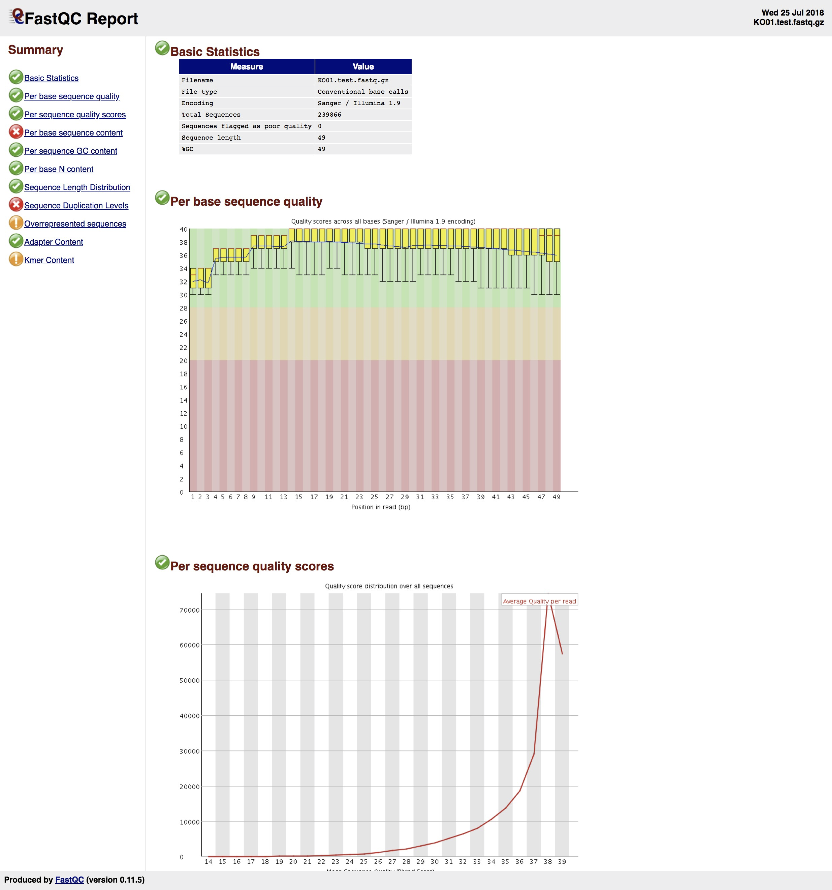

You can check [FastQC Help](https://www.bioinformatics.babraham.ac.uk/projects/fastqc/Help/3%20Analysis%20Modules/) for more details about how to interpret a FastQC report.

Or, compare your reports to the example reports provided by FastQC for a [Good Illumina Data](https://www.bioinformatics.babraham.ac.uk/projects/fastqc/good_sequence_short_fastqc.html) or [Bad Illumina Data](https://www.bioinformatics.babraham.ac.uk/projects/fastqc/bad_sequence_fastqc.html).


### <a name="Aln"/>Step 2.1: Read Alignment | [Top](#Top)


In this step, the pipeline will conduct read alignment on the raw fastq files.

The BDS code snippet for the sample KO01 will look like:


```bash
$ grep -A1 run.alignRead.star.SRR1205282.sh example/DLBC/Submit_RNAseq.DLBC.bds
dep( [ '/home/USER/cri_rnaseq/cri_rnaseq_2018/example/DLBC/RNAseq/Aln/star/KO01/SRR1205282/SRR1205282.star.bam' ] <- [ '/group/bioinformatics/CRI_RNAseq_2018/example/data/KO01.test.fastq.gz' ], cpus := 4, mem := 64*G, timeout := 72*hour, taskName := "star.SRR1205282") sys bash /home/USER/cri_rnaseq/cri_rnaseq_2018/example/DLBC/RNAseq/shell_scripts/run.alignRead.star.SRR1205282.sh; sleep 2
goal( [ '/home/USER/cri_rnaseq/cri_rnaseq_2018/example/DLBC/RNAseq/Aln/star/KO01/SRR1205282/SRR1205282.star.bam' ] )
```

This code chunk will invoke the bash script example/DLBC/RNAseq/shell_scripts/**`run.alignRead.star.SRR1205282.sh`** to execute STAR on the KO01(SRR1205282) sequencing library.

After the completion of the entire pipeline, you can check the alignment result of each individual libraries; for instance, the result of KO01(SRR1205282) will be as follows.


```bash
$ tree example/DLBC/RNAseq/Aln/star/KO01/SRR1205282
example/DLBC/RNAseq/Aln/star/KO01/SRR1205282
|-- SRR1205282.star.Aligned.sortedByCoord.out.bam
|-- SRR1205282.star.Log.final.out
|-- SRR1205282.star.Log.out
|-- SRR1205282.star.Log.progress.out
|-- SRR1205282.star.SJ.out.tab
|-- SRR1205282.star.Unmapped.out.mate1
|-- SRR1205282.star.bai
|-- SRR1205282.star.bam -> SRR1205282.star.Aligned.sortedByCoord.out.bam
`-- run.alignRead.star.SRR1205282.log
```

You can check a log file (e.g., **example/DLBC/RNAseq/Aln/star/KO01/`SRR1205282/SRR1205282.star.Log.final.out`**) for more alignment information provided by STAR.


```bash
$ cat example/DLBC/RNAseq/Aln/star/KO01/SRR1205282/SRR1205282.star.Log.final.out
                                 Started job on |	Jul 25 13:38:32
                             Started mapping on |	Jul 25 13:38:59
                                    Finished on |	Jul 25 13:39:03
       Mapping speed, Million of reads per hour |	215.88

                          Number of input reads |	239866
                      Average input read length |	49
                                    UNIQUE READS:
                   Uniquely mapped reads number |	238305
                        Uniquely mapped reads % |	99.35%
                          Average mapped length |	48.84
                       Number of splices: Total |	43900
            Number of splices: Annotated (sjdb) |	43566
                       Number of splices: GT/AG |	43729
                       Number of splices: GC/AG |	171
                       Number of splices: AT/AC |	0
               Number of splices: Non-canonical |	0
                      Mismatch rate per base, % |	0.22%
                         Deletion rate per base |	0.01%
                        Deletion average length |	1.98
                        Insertion rate per base |	0.00%
                       Insertion average length |	1.37
                             MULTI-MAPPING READS:
        Number of reads mapped to multiple loci |	0
             % of reads mapped to multiple loci |	0.00%
        Number of reads mapped to too many loci |	1552
             % of reads mapped to too many loci |	0.65%
                                  UNMAPPED READS:
       % of reads unmapped: too many mismatches |	0.00%
                 % of reads unmapped: too short |	0.00%
                     % of reads unmapped: other |	0.00%
                                  CHIMERIC READS:
                       Number of chimeric reads |	0
                            % of chimeric reads |	0.00%
```


### <a name="AlnQC"/>Step 2.2: Alignment QC | [Top](#Top)


In this step, the pipeline will conduct a QC on alignment result.

The BDS code snippets for the sample KO01 will look like:


```bash
$ grep -A1 run.alnQC.*.star.KO01.*.sh example/DLBC/Submit_RNAseq.DLBC.bds
dep( [ '/home/USER/cri_rnaseq/cri_rnaseq_2018/example/DLBC/RNAseq/AlnQC/picard/star/KO01/KO01.star.picard.RNA_Metrics', '/home/USER/cri_rnaseq/cri_rnaseq_2018/example/DLBC/RNAseq/AlnQC/picard/star/KO01/KO01.star.picard.RNA_Metrics.pdf' ] <- [ '/home/USER/cri_rnaseq/cri_rnaseq_2018/example/DLBC/RNAseq/Aln/star/KO01/KO01.star.bai' ], cpus := 4, mem := 32*G, timeout := 72*hour, taskName := "picard.star.KO01") sys bash /home/USER/cri_rnaseq/cri_rnaseq_2018/example/DLBC/RNAseq/shell_scripts/run.alnQC.picard.star.KO01.CollectRnaSeqMetrics.sh; sleep 2
goal( [ '/home/USER/cri_rnaseq/cri_rnaseq_2018/example/DLBC/RNAseq/AlnQC/picard/star/KO01/KO01.star.picard.RNA_Metrics', '/home/USER/cri_rnaseq/cri_rnaseq_2018/example/DLBC/RNAseq/AlnQC/picard/star/KO01/KO01.star.picard.RNA_Metrics.pdf' ] )
--
dep( [ '/home/USER/cri_rnaseq/cri_rnaseq_2018/example/DLBC/RNAseq/AlnQC/rseqc/star/KO01/KO01.star.rseqc.clipping_profile.xls', '/home/USER/cri_rnaseq/cri_rnaseq_2018/example/DLBC/RNAseq/AlnQC/rseqc/star/KO01/KO01.star.rseqc.clipping_profile.r', '/home/USER/cri_rnaseq/cri_rnaseq_2018/example/DLBC/RNAseq/AlnQC/rseqc/star/KO01/KO01.star.rseqc.clipping_profile.pdf' ] <- [ '/home/USER/cri_rnaseq/cri_rnaseq_2018/example/DLBC/RNAseq/Aln/star/KO01/KO01.star.bai' ], cpus := 1, mem := 8*G, timeout := 72*hour, taskName := "rseqc.star.KO01") sys bash /home/USER/cri_rnaseq/cri_rnaseq_2018/example/DLBC/RNAseq/shell_scripts/run.alnQC.rseqc.star.KO01.clipping_profile.py.sh; sleep 2
goal( [ '/home/USER/cri_rnaseq/cri_rnaseq_2018/example/DLBC/RNAseq/AlnQC/rseqc/star/KO01/KO01.star.rseqc.clipping_profile.xls', '/home/USER/cri_rnaseq/cri_rnaseq_2018/example/DLBC/RNAseq/AlnQC/rseqc/star/KO01/KO01.star.rseqc.clipping_profile.r', '/home/USER/cri_rnaseq/cri_rnaseq_2018/example/DLBC/RNAseq/AlnQC/rseqc/star/KO01/KO01.star.rseqc.clipping_profile.pdf' ] )
--
dep( [ '/home/USER/cri_rnaseq/cri_rnaseq_2018/example/DLBC/RNAseq/AlnQC/rseqc/star/KO01/KO01.star.rseqc.infer_experiment.txt' ] <- [ '/home/USER/cri_rnaseq/cri_rnaseq_2018/example/DLBC/RNAseq/Aln/star/KO01/KO01.star.bai' ], cpus := 1, mem := 8*G, timeout := 72*hour, taskName := "rseqc.star.KO01") sys bash /home/USER/cri_rnaseq/cri_rnaseq_2018/example/DLBC/RNAseq/shell_scripts/run.alnQC.rseqc.star.KO01.infer_experiment.py.sh; sleep 2
goal( [ '/home/USER/cri_rnaseq/cri_rnaseq_2018/example/DLBC/RNAseq/AlnQC/rseqc/star/KO01/KO01.star.rseqc.infer_experiment.txt' ] )
--
dep( [ '/home/USER/cri_rnaseq/cri_rnaseq_2018/example/DLBC/RNAseq/AlnQC/rseqc/star/KO01/KO01.star.rseqc.eRPKM.xls', '/home/USER/cri_rnaseq/cri_rnaseq_2018/example/DLBC/RNAseq/AlnQC/rseqc/star/KO01/KO01.star.rseqc.rawCount.xls', '/home/USER/cri_rnaseq/cri_rnaseq_2018/example/DLBC/RNAseq/AlnQC/rseqc/star/KO01/KO01.star.rseqc.saturation.r' ] <- [ '/home/USER/cri_rnaseq/cri_rnaseq_2018/example/DLBC/RNAseq/Aln/star/KO01/KO01.star.bai' ], cpus := 1, mem := 8*G, timeout := 72*hour, taskName := "rseqc.star.KO01") sys bash /home/USER/cri_rnaseq/cri_rnaseq_2018/example/DLBC/RNAseq/shell_scripts/run.alnQC.rseqc.star.KO01.RPKM_saturation.py.sh; sleep 2
goal( [ '/home/USER/cri_rnaseq/cri_rnaseq_2018/example/DLBC/RNAseq/AlnQC/rseqc/star/KO01/KO01.star.rseqc.eRPKM.xls', '/home/USER/cri_rnaseq/cri_rnaseq_2018/example/DLBC/RNAseq/AlnQC/rseqc/star/KO01/KO01.star.rseqc.rawCount.xls', '/home/USER/cri_rnaseq/cri_rnaseq_2018/example/DLBC/RNAseq/AlnQC/rseqc/star/KO01/KO01.star.rseqc.saturation.r' ] )
```

This code chunk will invoke few bash scripts (e.g., example/DLBC/RNAseq/shell_scripts/**`run.alnQC.picard.star.KO01.CollectRnaSeqMetrics.sh`**, **`run.alnQC.rseqc.star.KO01.clipping_profile.py.sh`**, **`run.alnQC.rseqc.star.KO01.infer_experiment.py.sh`**, and **`run.alnQC.rseqc.star.KO01.RPKM_saturation.py.sh`**) to execute alignment QC tools (i.e., Picard and RSeQC) on the sample KO01.

After the completion of the entire pipeline, you can check the alignment QC results of each individual samples; for instance, the results of KO01 will be as follows.


```bash
$ ls example/DLBC/RNAseq/AlnQC/*/star/KO01
example/DLBC/RNAseq/AlnQC/picard/star/KO01:
KO01.star.picard.RNA_Metrics  KO01.star.picard.RNA_Metrics.pdf  run.alnQC.picard.star.KO01.CollectRnaSeqMetrics.log  tmp

example/DLBC/RNAseq/AlnQC/rseqc/star/KO01:
KO01.star.pdfseqc.saturation.pdf      KO01.star.rseqc.eRPKM.xls             run.alnQC.rseqc.star.KO01.RPKM_saturation.py.log
KO01.star.rseqc.clipping_profile.pdf  KO01.star.rseqc.infer_experiment.txt  run.alnQC.rseqc.star.KO01.clipping_profile.py.log
KO01.star.rseqc.clipping_profile.r    KO01.star.rseqc.rawCount.xls          tmp
KO01.star.rseqc.clipping_profile.xls  KO01.star.rseqc.saturation.r
```

You can check alignment statistics (e.g., **example/DLBC/RNAseq/AlnQC/picard/star/KO01/`KO01.star.picard.RNA_Metrics`**) for more information provided by Picard.


```bash
$ head example/DLBC/RNAseq/AlnQC/picard/star/KO01/KO01.star.picard.RNA_Metrics
## htsjdk.samtools.metrics.StringHeader
# picard.analysis.CollectRnaSeqMetrics REF_FLAT=/group/bioinformatics/CRI_RNAseq_2018/example/reference/GRCh38.primary_Gencode24_50bp_chr11/gencode.v24.primary_assembly.annotation.chr11.refFlat.txt RIBOSOMAL_INTERVALS=/group/bioinformatics/CRI_RNAseq_2018/example/reference/GRCh38.primary_Gencode24_50bp_chr11/gencode.v24.primary_assembly.annotation.chr11.rRNA.interval_list STRAND_SPECIFICITY=NONE CHART_OUTPUT=/home/USER/cri_rnaseq/cri_rnaseq_2018/example/DLBC/RNAseq/AlnQC/picard/star/KO01/KO01.star.picard.RNA_Metrics.pdf METRIC_ACCUMULATION_LEVEL=[SAMPLE, ALL_READS] INPUT=/home/USER/cri_rnaseq/cri_rnaseq_2018/example/DLBC/RNAseq/Aln/star/KO01/KO01.star.bam OUTPUT=/home/USER/cri_rnaseq/cri_rnaseq_2018/example/DLBC/RNAseq/AlnQC/picard/star/KO01/KO01.star.picard.RNA_Metrics TMP_DIR=[/home/USER/cri_rnaseq/cri_rnaseq_2018/example/DLBC/RNAseq/AlnQC/picard/star/KO01/tmp]    MINIMUM_LENGTH=500 RRNA_FRAGMENT_PERCENTAGE=0.8 ASSUME_SORTED=true STOP_AFTER=0 VERBOSITY=INFO QUIET=false VALIDATION_STRINGENCY=STRICT COMPRESSION_LEVEL=5 MAX_RECORDS_IN_RAM=500000 CREATE_INDEX=false CREATE_MD5_FILE=false GA4GH_CLIENT_SECRETS=client_secrets.json
## htsjdk.samtools.metrics.StringHeader
# Started on: Wed Jul 25 13:41:44 CDT 2018

## METRICS CLASS	picard.analysis.RnaSeqMetrics
PF_BASES	PF_ALIGNED_BASES	RIBOSOMAL_BASES	CODING_BASES	UTR_BASES	INTRONIC_BASES	INTERGENIC_BASES	IGNORED_READS	CORRECT_STRAND_READS	INCORRECT_STRAND_READS	PCT_RIBOSOMAL_BASES	PCT_CODING_BASES	PCT_UTR_BASES	PCT_INTRONIC_BASES	PCT_INTERGENIC_BASES	PCT_MRNA_BASES	PCT_USABLE_BASES	PCT_CORRECT_STRAND_READS	MEDIAN_CV_COVERAGE	MEDIAN_5PRIME_BIAS	MEDIAN_3PRIME_BIAS	MEDIAN_5PRIME_TO_3PRIME_BIAS	SAMPLE	LIBRARY	READ_GROUP
11676945	11638066	0	6586023	4106888	849952	95203	0	0	0	0	0.565904	0.352884	0.073032	0.008180.918788	0.915728	0	0.522396	0.602183	0.758017	0.701572
11676945	11638066	0	6586023	4106888	849952	95203	0	0	0	0	0.565904	0.352884	0.073032	0.008180.918788	0.915728	0	0.522396	0.602183	0.758017	0.701572	unknown
```

Or, the respective coverage plot of the sample KO01 produced by Picard will be as follows.

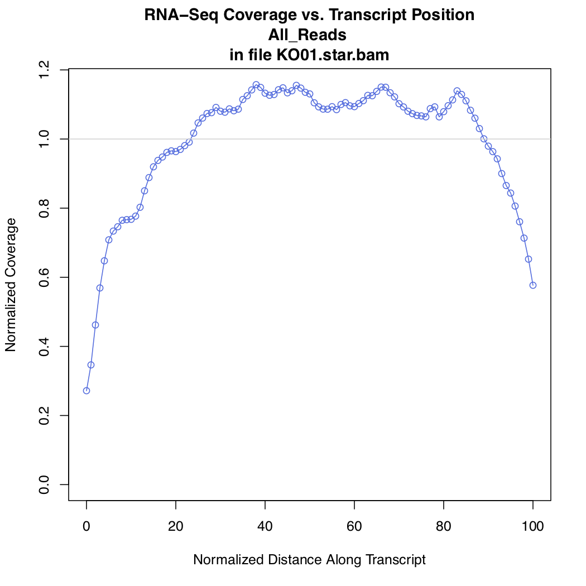

There are three alignment measurements performed using [RSeQC](http://rseqc.sourceforge.net).

1. [clipping_profile.py](http://rseqc.sourceforge.net/#clipping-profile-py)
    * Calculate the distributions of clipped nucleotides across reads
2. [infer_experiment.py](http://rseqc.sourceforge.net/#infer-experiment-py)
    * Use to “guess” how RNA-seq sequencing was configured, particularly how reads were stranded for strand-specific RNA-seq data, through comparing the “strandedness of reads” with the “strandedness of transcripts”.
3. [RPKM_saturation.py](http://rseqc.sourceforge.net/#rpkm-saturation-py)
    * Calculate RPKM value using a series of resampled subsets from total RNA reads to check if the current sequencing depth was saturated or not (or if the RPKM values were stable or not) in terms of genes’ expression estimation

The results will be as follows. Please check the [RSeQC](http://rseqc.sourceforge.net) website for more measurements and details.


```bash
$cat example/DLBC/RNAseq/AlnQC/rseqc/star/KO01/KO01.star.rseqc.infer_experiment.txt
```

```
## 
## 
## This is SingleEnd Data
## Fraction of reads failed to determine: 0.0025
## Fraction of reads explained by "++,--": 0.6025
## Fraction of reads explained by "+-,-+": 0.3950
```
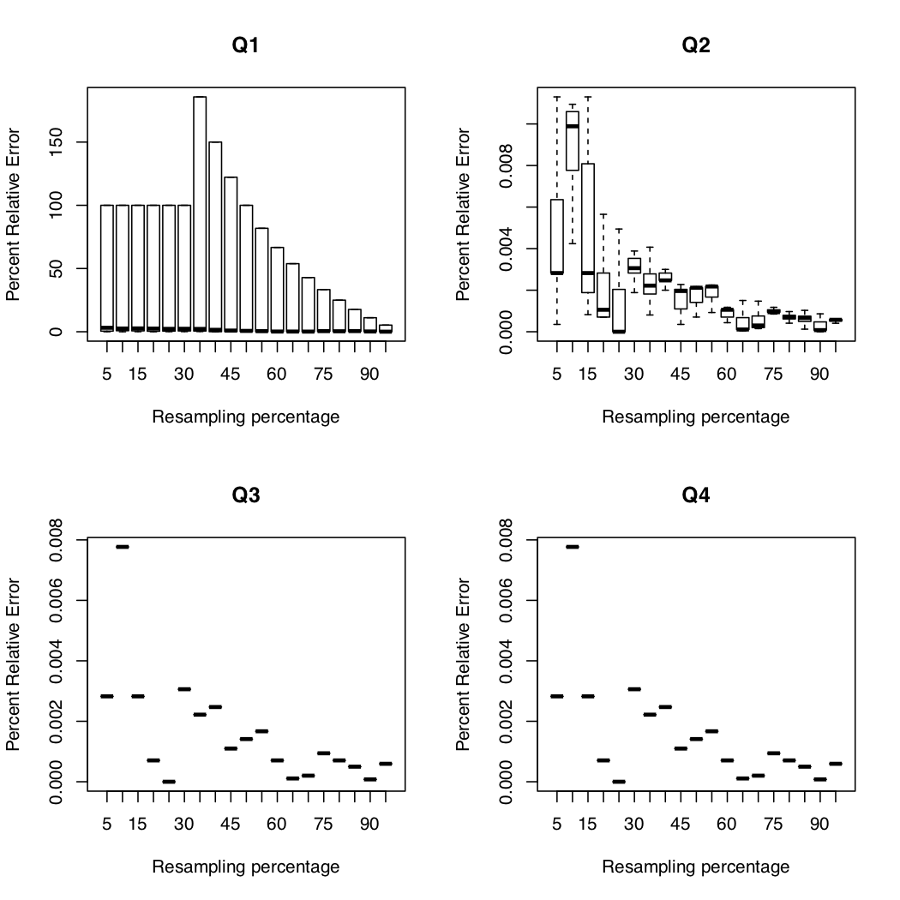


### <a name="Quant"/>Step 3: Expression Quantification | [Top](#Top)

In this step, the pipeline will conduct expression quantification over alignments.

The BDS code snippet for the sample KO01 will look like:


```bash
$ grep -A1 run.quant.featurecounts.star.KO01.sh example/DLBC/Submit_RNAseq.DLBC.bds
dep( [ '/home/USER/cri_rnaseq/cri_rnaseq_2018/example/DLBC/RNAseq/Quantification/featurecounts/star/KO01/KO01.star.featurecounts.count' ] <- [ '/home/USER/cri_rnaseq/cri_rnaseq_2018/example/DLBC/RNAseq/Aln/star/KO01/KO01.star.bai' ], cpus := 4, mem := 32*G, timeout := 72*hour, taskName := "featurecounts.star.KO01") sys bash /home/USER/cri_rnaseq/cri_rnaseq_2018/example/DLBC/RNAseq/shell_scripts/run.quant.featurecounts.star.KO01.sh; sleep 2
goal( [ '/home/USER/cri_rnaseq/cri_rnaseq_2018/example/DLBC/RNAseq/Quantification/featurecounts/star/KO01/KO01.star.featurecounts.count' ] )
```

This code chunk will invoke the bash script (e.g., example/DLBC/RNAseq/shell_scripts/**`run.quant.featurecounts.star.KO01.sh`**) to execute expression quantification tool (i.e., [Subread](http://subread.sourceforge.net/)::[featureCounts](http://bioinf.wehi.edu.au/featureCounts/) on the sample KO01.

After the completion of the entire pipeline, you can check the quantification results of each individual samples; for instance, the results of KO01 will be as follows.


```bash
$ tree example/DLBC/RNAseq/Quantification/featurecounts/star/KO01
example/DLBC/RNAseq/Quantification/featurecounts/star/KO01
|-- KO01.star.featurecounts.count
|-- KO01.star.featurecounts.count.jcounts
|-- KO01.star.featurecounts.count.summary
`-- run.quant.featurecounts.star.KO01.log
```

You can check quantification statistics (e.g., **example/DLBC/RNAseq/Quantification/featurecounts/star/KO01`KO01.star.featurecounts.count.summary`**) for more information provided by [Subread](http://subread.sourceforge.net/)::[featureCounts](http://bioinf.wehi.edu.au/featureCounts/)


```bash
$ cat example/DLBC/RNAseq/Quantification/featurecounts/star/KO01/KO01.star.featurecounts.count.summary
Status	/home/USER/cri_rnaseq/cri_rnaseq_2018/example/DLBC/RNAseq/Aln/star/KO01/KO01.star.bam
Assigned	213869
Unassigned_Unmapped	0
Unassigned_MappingQuality	0
Unassigned_Chimera	0
Unassigned_FragmentLength	0
Unassigned_Duplicate	0
Unassigned_MultiMapping	0
Unassigned_Secondary	0
Unassigned_Nonjunction	0
Unassigned_NoFeatures	17539
Unassigned_Overlapping_Length	0
Unassigned_Ambiguity	6897
```

Or, the top 10 most abundant genes in the sample KO01 (on chr11) will be as follows.


```bash
$ cat <(head -n2 example/DLBC/RNAseq/Quantification/featurecounts/star/KO01/KO01.star.featurecounts.count | tail -n+2 | cut -f1,7) <(cut -f1,7 example/DLBC/RNAseq/Quantification/featurecounts/star/KO01/KO01.star.featurecounts.count | sort -k2,2nr | head)
```

<div style="border: 1px solid #ddd; padding: 5px; overflow-y: scroll; height:300px; overflow-x: scroll; width:100%; "><table class="table table-striped table-hover table-condensed table-responsive" style="margin-left: auto; margin-right: auto;">
<caption>Top 10 most abundant genes in KO01</caption>
 <thead>
  <tr>
   <th style="text-align:left;"> Geneid </th>
   <th style="text-align:left;"> Chr </th>
   <th style="text-align:left;"> Start </th>
   <th style="text-align:left;"> End </th>
   <th style="text-align:left;"> Strand </th>
   <th style="text-align:left;"> Length </th>
   <th style="text-align:left;"> KO01 </th>
  </tr>
 </thead>
<tbody>
  <tr>
   <td style="text-align:left;"> ENSG00000175216.14 </td>
   <td style="text-align:left;"> chr11 </td>
   <td style="text-align:left;"> 46743048 </td>
   <td style="text-align:left;"> 46846229 </td>
   <td style="text-align:left;"> - </td>
   <td style="text-align:left;"> 8538 </td>
   <td style="text-align:left;"> 25908 </td>
  </tr>
  <tr>
   <td style="text-align:left;"> ENSG00000149187.17 </td>
   <td style="text-align:left;"> chr11 </td>
   <td style="text-align:left;"> 47465944 </td>
   <td style="text-align:left;"> 47565520 </td>
   <td style="text-align:left;"> - </td>
   <td style="text-align:left;"> 10441 </td>
   <td style="text-align:left;"> 17065 </td>
  </tr>
  <tr>
   <td style="text-align:left;"> ENSG00000166181.12 </td>
   <td style="text-align:left;"> chr11 </td>
   <td style="text-align:left;"> 43311963 </td>
   <td style="text-align:left;"> 43342676 </td>
   <td style="text-align:left;"> + </td>
   <td style="text-align:left;"> 4651 </td>
   <td style="text-align:left;"> 13992 </td>
  </tr>
  <tr>
   <td style="text-align:left;"> ENSG00000149177.12 </td>
   <td style="text-align:left;"> chr11 </td>
   <td style="text-align:left;"> 47980558 </td>
   <td style="text-align:left;"> 48170841 </td>
   <td style="text-align:left;"> + </td>
   <td style="text-align:left;"> 9620 </td>
   <td style="text-align:left;"> 13503 </td>
  </tr>
  <tr>
   <td style="text-align:left;"> ENSG00000244313.3 </td>
   <td style="text-align:left;"> chr11 </td>
   <td style="text-align:left;"> 46428653 </td>
   <td style="text-align:left;"> 46429150 </td>
   <td style="text-align:left;"> - </td>
   <td style="text-align:left;"> 498 </td>
   <td style="text-align:left;"> 10870 </td>
  </tr>
  <tr>
   <td style="text-align:left;"> ENSG00000030066.13 </td>
   <td style="text-align:left;"> chr11 </td>
   <td style="text-align:left;"> 47778087 </td>
   <td style="text-align:left;"> 47848467 </td>
   <td style="text-align:left;"> - </td>
   <td style="text-align:left;"> 8576 </td>
   <td style="text-align:left;"> 10493 </td>
  </tr>
  <tr>
   <td style="text-align:left;"> ENSG00000165916.8 </td>
   <td style="text-align:left;"> chr11 </td>
   <td style="text-align:left;"> 47418769 </td>
   <td style="text-align:left;"> 47426266 </td>
   <td style="text-align:left;"> - </td>
   <td style="text-align:left;"> 2276 </td>
   <td style="text-align:left;"> 9331 </td>
  </tr>
  <tr>
   <td style="text-align:left;"> ENSG00000149084.11 </td>
   <td style="text-align:left;"> chr11 </td>
   <td style="text-align:left;"> 43556436 </td>
   <td style="text-align:left;"> 43856610 </td>
   <td style="text-align:left;"> + </td>
   <td style="text-align:left;"> 8600 </td>
   <td style="text-align:left;"> 9247 </td>
  </tr>
  <tr>
   <td style="text-align:left;"> ENSG00000109919.9 </td>
   <td style="text-align:left;"> chr11 </td>
   <td style="text-align:left;"> 47617315 </td>
   <td style="text-align:left;"> 47642595 </td>
   <td style="text-align:left;"> - </td>
   <td style="text-align:left;"> 2897 </td>
   <td style="text-align:left;"> 8005 </td>
  </tr>
  <tr>
   <td style="text-align:left;"> ENSG00000109920.12 </td>
   <td style="text-align:left;"> chr11 </td>
   <td style="text-align:left;"> 47716517 </td>
   <td style="text-align:left;"> 47767301 </td>
   <td style="text-align:left;"> - </td>
   <td style="text-align:left;"> 7596 </td>
   <td style="text-align:left;"> 7883 </td>
  </tr>
</tbody>
</table></div>


### <a name="DEG"/>Step 4-1: Identify Differentially Expressed Genes (DEGs) | [Top](#Top)


In this step, the pipeline will identify differentially expressed genes (DEG) according to the alignment result files (i.e., BAM files) after the alignment step.

The BDS code snippets for the example dataset will look like:


```bash
$ grep -A1 run.call.*.featurecounts.star.DLBC.sh example/DLBC/Submit_RNAseq.DLBC.bds
dep( [ '/home/USER/cri_rnaseq/cri_rnaseq_2018/example/DLBC/RNAseq/DEG/edger/featurecounts/star/DLBC.star.featurecounts.edger.count.txt' ] <- [ '/home/USER/cri_rnaseq/cri_rnaseq_2018/example/DLBC/RNAseq/Quantification/featurecounts/star/KO01/KO01.star.featurecounts.count', '/home/USER/cri_rnaseq/cri_rnaseq_2018/example/DLBC/RNAseq/Quantification/featurecounts/star/KO02/KO02.star.featurecounts.count', '/home/USER/cri_rnaseq/cri_rnaseq_2018/example/DLBC/RNAseq/Quantification/featurecounts/star/KO03/KO03.star.featurecounts.count', '/home/USER/cri_rnaseq/cri_rnaseq_2018/example/DLBC/RNAseq/Quantification/featurecounts/star/WT01/WT01.star.featurecounts.count', '/home/USER/cri_rnaseq/cri_rnaseq_2018/example/DLBC/RNAseq/Quantification/featurecounts/star/WT02/WT02.star.featurecounts.count', '/home/USER/cri_rnaseq/cri_rnaseq_2018/example/DLBC/RNAseq/Quantification/featurecounts/star/WT03/WT03.star.featurecounts.count' ], cpus := 4, mem := 32*G, timeout := 72*hour, taskName := "edger.featurecounts.star.DLBC") sys bash /home/USER/cri_rnaseq/cri_rnaseq_2018/example/DLBC/RNAseq/shell_scripts/run.call.edger.featurecounts.star.DLBC.sh; sleep 2
goal( [ '/home/USER/cri_rnaseq/cri_rnaseq_2018/example/DLBC/RNAseq/DEG/edger/featurecounts/star/DLBC.star.featurecounts.edger.count.txt' ] )
--
dep( [ '/home/USER/cri_rnaseq/cri_rnaseq_2018/example/DLBC/RNAseq/DEG/deseq2/featurecounts/star/DLBC.star.featurecounts.deseq2.count.txt' ] <- [ '/home/USER/cri_rnaseq/cri_rnaseq_2018/example/DLBC/RNAseq/Quantification/featurecounts/star/KO01/KO01.star.featurecounts.count', '/home/USER/cri_rnaseq/cri_rnaseq_2018/example/DLBC/RNAseq/Quantification/featurecounts/star/KO02/KO02.star.featurecounts.count', '/home/USER/cri_rnaseq/cri_rnaseq_2018/example/DLBC/RNAseq/Quantification/featurecounts/star/KO03/KO03.star.featurecounts.count', '/home/USER/cri_rnaseq/cri_rnaseq_2018/example/DLBC/RNAseq/Quantification/featurecounts/star/WT01/WT01.star.featurecounts.count', '/home/USER/cri_rnaseq/cri_rnaseq_2018/example/DLBC/RNAseq/Quantification/featurecounts/star/WT02/WT02.star.featurecounts.count', '/home/USER/cri_rnaseq/cri_rnaseq_2018/example/DLBC/RNAseq/Quantification/featurecounts/star/WT03/WT03.star.featurecounts.count' ], cpus := 4, mem := 32*G, timeout := 72*hour, taskName := "deseq2.featurecounts.star.DLBC") sys bash /home/USER/cri_rnaseq/cri_rnaseq_2018/example/DLBC/RNAseq/shell_scripts/run.call.deseq2.featurecounts.star.DLBC.sh; sleep 2
goal( [ '/home/USER/cri_rnaseq/cri_rnaseq_2018/example/DLBC/RNAseq/DEG/deseq2/featurecounts/star/DLBC.star.featurecounts.deseq2.count.txt' ] )
--
dep( [ '/home/USER/cri_rnaseq/cri_rnaseq_2018/example/DLBC/RNAseq/DEG/limma/featurecounts/star/DLBC.star.featurecounts.limma.count.txt' ] <- [ '/home/USER/cri_rnaseq/cri_rnaseq_2018/example/DLBC/RNAseq/Quantification/featurecounts/star/KO01/KO01.star.featurecounts.count', '/home/USER/cri_rnaseq/cri_rnaseq_2018/example/DLBC/RNAseq/Quantification/featurecounts/star/KO02/KO02.star.featurecounts.count', '/home/USER/cri_rnaseq/cri_rnaseq_2018/example/DLBC/RNAseq/Quantification/featurecounts/star/KO03/KO03.star.featurecounts.count', '/home/USER/cri_rnaseq/cri_rnaseq_2018/example/DLBC/RNAseq/Quantification/featurecounts/star/WT01/WT01.star.featurecounts.count', '/home/USER/cri_rnaseq/cri_rnaseq_2018/example/DLBC/RNAseq/Quantification/featurecounts/star/WT02/WT02.star.featurecounts.count', '/home/USER/cri_rnaseq/cri_rnaseq_2018/example/DLBC/RNAseq/Quantification/featurecounts/star/WT03/WT03.star.featurecounts.count' ], cpus := 4, mem := 32*G, timeout := 72*hour, taskName := "limma.featurecounts.star.DLBC") sys bash /home/USER/cri_rnaseq/cri_rnaseq_2018/example/DLBC/RNAseq/shell_scripts/run.call.limma.featurecounts.star.DLBC.sh; sleep 2
goal( [ '/home/USER/cri_rnaseq/cri_rnaseq_2018/example/DLBC/RNAseq/DEG/limma/featurecounts/star/DLBC.star.featurecounts.limma.count.txt' ] )
```

This code chunk will invoke few bash scripts (e.g., example/DLBC/RNAseq/shell_scripts/**`run.call.edger.featurecounts.star.DLBC.sh`**, **`run.call.deseq2.featurecounts.star.DLBC.sh`**, and **`run.call.limma.featurecounts.star.DLBC.sh`**) to execute differential expression (DE) analysis using three the state-of-the-art tools  (i.e., [edgeR](https://bioconductor.org/packages/release/bioc/html/edgeR.html), [DESeq2](https://bioconductor.org/packages/release/bioc/html/DESeq2.html), and [limma](https://bioconductor.org/packages/release/bioc/html/limma.html)) on the example dataset of six samples from KO01 to WT03.


There are three DE analysis tools used in the current pipeline, including

1. [edgeR](https://bioconductor.org/packages/release/bioc/html/edgeR.html): Empirical Analysis of Digital Gene Expression Data in R
2. [DESeq2](https://bioconductor.org/packages/release/bioc/html/DESeq2.html): Differential gene expression analysis based on the negative binomial distribution
3. [limma](https://bioconductor.org/packages/release/bioc/html/limma.html): Linear Models for Microarray Data

After the completion of the entire pipeline, you can check the calling results of each individual methods; for instance, the analysis results of the example dataset will be as follows.


```bash
$ ls example/DLBC/RNAseq/DEG/*/featurecounts/star/
example/DLBC/RNAseq/DEG/deseq2/featurecounts/star/:
DLBC.star.featurecounts.deseq2.RData
DLBC.star.featurecounts.deseq2.count.ntd.meanSdPlot.pdf
DLBC.star.featurecounts.deseq2.count.ntd.txt
DLBC.star.featurecounts.deseq2.count.rld.meanSdPlot.pdf
DLBC.star.featurecounts.deseq2.count.rld.txt
DLBC.star.featurecounts.deseq2.count.txt
DLBC.star.featurecounts.deseq2.count.vst.meanSdPlot.pdf
DLBC.star.featurecounts.deseq2.count.vst.txt
DLBC.star.featurecounts.deseq2.plotDispEsts.pdf
DLBC.star.featurecounts.deseq2.plotMA.pdf
DLBC.star.featurecounts.deseq2.test.DEG.txt
DLBC.star.featurecounts.deseq2.test.txt
run.call.deseq2.featurecounts.star.DLBC.log

example/DLBC/RNAseq/DEG/edger/featurecounts/star/:
DLBC.star.featurecounts.edger.RData        DLBC.star.featurecounts.edger.plotSmear.pdf
DLBC.star.featurecounts.edger.count.txt    DLBC.star.featurecounts.edger.test.DEG.txt
DLBC.star.featurecounts.edger.plotBCV.pdf  DLBC.star.featurecounts.edger.test.txt
DLBC.star.featurecounts.edger.plotMA.pdf   run.call.edger.featurecounts.star.DLBC.log

example/DLBC/RNAseq/DEG/limma/featurecounts/star/:
DLBC.star.featurecounts.limma.RData
DLBC.star.featurecounts.limma.count.voom.meanSdPlot.pdf
DLBC.star.featurecounts.limma.count.txt
DLBC.star.featurecounts.limma.plotMA.pdf
DLBC.star.featurecounts.limma.test.DEG.txt
DLBC.star.featurecounts.limma.test.txt
DLBC.star.featurecounts.limma.voom.mean-variance.pdf
run.call.limma.featurecounts.star.DLBC.log
```

You can check statistical test results per gene (e.g., **example/DLBC/RNAseq/DEG/deseq2/featurecounts/star/`DLBC.star.featurecounts.deseq2.test.txt`**) for more information generated by each method.


```bash
$ head example/DLBC/RNAseq/DEG/deseq2/featurecounts/star/DLBC.star.featurecounts.deseq2.test.txt
```

<div style="border: 1px solid #ddd; padding: 5px; overflow-y: scroll; height:300px; overflow-x: scroll; width:100%; "><table class="table table-striped table-hover table-condensed table-responsive" style="margin-left: auto; margin-right: auto;">
<caption>Statistical test result per gene using DESeq2</caption>
 <thead>
  <tr>
   <th style="text-align:left;">   </th>
   <th style="text-align:left;"> Geneid </th>
   <th style="text-align:right;"> baseMean </th>
   <th style="text-align:right;"> log2FoldChange </th>
   <th style="text-align:right;"> lfcSE </th>
   <th style="text-align:right;"> stat </th>
   <th style="text-align:right;"> pvalue </th>
   <th style="text-align:right;"> FDR </th>
   <th style="text-align:right;"> DEG </th>
  </tr>
 </thead>
<tbody>
  <tr>
   <td style="text-align:left;"> 4249 </td>
   <td style="text-align:left;"> ENSG00000120738.7 </td>
   <td style="text-align:right;"> 5193.2844 </td>
   <td style="text-align:right;"> 1.960273 </td>
   <td style="text-align:right;"> 0.1147988 </td>
   <td style="text-align:right;"> 17.07573 </td>
   <td style="text-align:right;"> 0 </td>
   <td style="text-align:right;"> 0 </td>
   <td style="text-align:right;"> 1 </td>
  </tr>
  <tr>
   <td style="text-align:left;"> 9872 </td>
   <td style="text-align:left;"> ENSG00000170345.9 </td>
   <td style="text-align:right;"> 422.7627 </td>
   <td style="text-align:right;"> 1.960006 </td>
   <td style="text-align:right;"> 0.1246756 </td>
   <td style="text-align:right;"> 15.72085 </td>
   <td style="text-align:right;"> 0 </td>
   <td style="text-align:right;"> 0 </td>
   <td style="text-align:right;"> 1 </td>
  </tr>
  <tr>
   <td style="text-align:left;"> 4273 </td>
   <td style="text-align:left;"> ENSG00000113070.7 </td>
   <td style="text-align:right;"> 1441.0826 </td>
   <td style="text-align:right;"> 1.386086 </td>
   <td style="text-align:right;"> 0.1041939 </td>
   <td style="text-align:right;"> 13.30296 </td>
   <td style="text-align:right;"> 0 </td>
   <td style="text-align:right;"> 0 </td>
   <td style="text-align:right;"> 1 </td>
  </tr>
  <tr>
   <td style="text-align:left;"> 9601 </td>
   <td style="text-align:left;"> ENSG00000100867.14 </td>
   <td style="text-align:right;"> 356.3080 </td>
   <td style="text-align:right;"> 1.707939 </td>
   <td style="text-align:right;"> 0.1339178 </td>
   <td style="text-align:right;"> 12.75364 </td>
   <td style="text-align:right;"> 0 </td>
   <td style="text-align:right;"> 0 </td>
   <td style="text-align:right;"> 1 </td>
  </tr>
  <tr>
   <td style="text-align:left;"> 8830 </td>
   <td style="text-align:left;"> ENSG00000229117.8 </td>
   <td style="text-align:right;"> 7121.3363 </td>
   <td style="text-align:right;"> -1.270634 </td>
   <td style="text-align:right;"> 0.1061629 </td>
   <td style="text-align:right;"> -11.96871 </td>
   <td style="text-align:right;"> 0 </td>
   <td style="text-align:right;"> 0 </td>
   <td style="text-align:right;"> -1 </td>
  </tr>
  <tr>
   <td style="text-align:left;"> 7342 </td>
   <td style="text-align:left;"> ENSG00000035403.17 </td>
   <td style="text-align:right;"> 855.0647 </td>
   <td style="text-align:right;"> -1.158327 </td>
   <td style="text-align:right;"> 0.1024376 </td>
   <td style="text-align:right;"> -11.30764 </td>
   <td style="text-align:right;"> 0 </td>
   <td style="text-align:right;"> 0 </td>
   <td style="text-align:right;"> -1 </td>
  </tr>
  <tr>
   <td style="text-align:left;"> 587 </td>
   <td style="text-align:left;"> ENSG00000177606.6 </td>
   <td style="text-align:right;"> 556.6779 </td>
   <td style="text-align:right;"> 1.267243 </td>
   <td style="text-align:right;"> 0.1122316 </td>
   <td style="text-align:right;"> 11.29133 </td>
   <td style="text-align:right;"> 0 </td>
   <td style="text-align:right;"> 0 </td>
   <td style="text-align:right;"> 1 </td>
  </tr>
  <tr>
   <td style="text-align:left;"> 4407 </td>
   <td style="text-align:left;"> ENSG00000038274.16 </td>
   <td style="text-align:right;"> 3176.8050 </td>
   <td style="text-align:right;"> -1.277175 </td>
   <td style="text-align:right;"> 0.1135558 </td>
   <td style="text-align:right;"> -11.24711 </td>
   <td style="text-align:right;"> 0 </td>
   <td style="text-align:right;"> 0 </td>
   <td style="text-align:right;"> -1 </td>
  </tr>
  <tr>
   <td style="text-align:left;"> 7462 </td>
   <td style="text-align:left;"> ENSG00000099194.5 </td>
   <td style="text-align:right;"> 27347.1594 </td>
   <td style="text-align:right;"> -1.157671 </td>
   <td style="text-align:right;"> 0.1036467 </td>
   <td style="text-align:right;"> -11.16940 </td>
   <td style="text-align:right;"> 0 </td>
   <td style="text-align:right;"> 0 </td>
   <td style="text-align:right;"> -1 </td>
  </tr>
  <tr>
   <td style="text-align:left;"> 734 </td>
   <td style="text-align:left;"> ENSG00000134215.15 </td>
   <td style="text-align:right;"> 2470.3706 </td>
   <td style="text-align:right;"> 1.200234 </td>
   <td style="text-align:right;"> 0.1078677 </td>
   <td style="text-align:right;"> 11.12691 </td>
   <td style="text-align:right;"> 0 </td>
   <td style="text-align:right;"> 0 </td>
   <td style="text-align:right;"> 1 </td>
  </tr>
</tbody>
</table></div>

> 

Or, the exploratory plots of the example dataset produced by DESeq2 will be as follows.

1. An exploratory plot of the per-gene dispersion estimates together with the fitted mean-dispersion relationship
    * 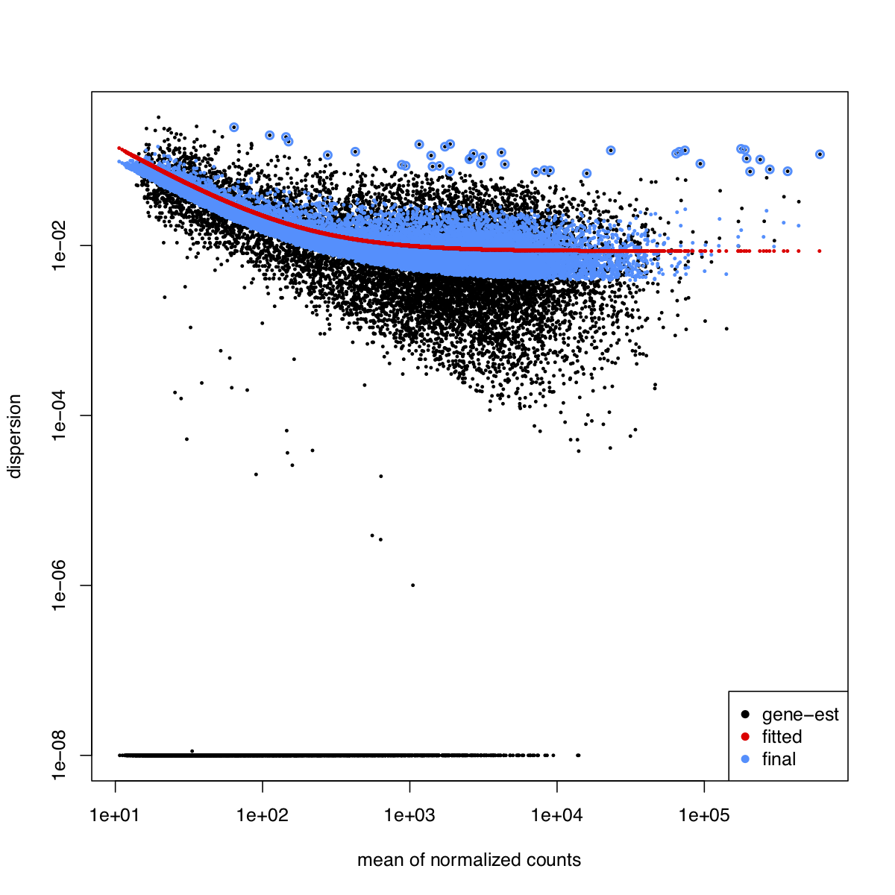
2. An exploratory plot of row standard deviations versus row means using the normalized counts transformation (f(count + pc))
    * 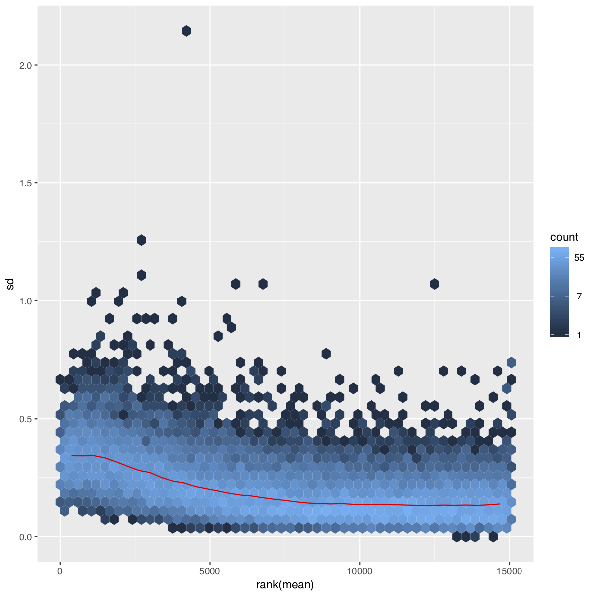
3. An exploratory plot of row standard deviations versus row means using the variance stabilizing transformation
    * 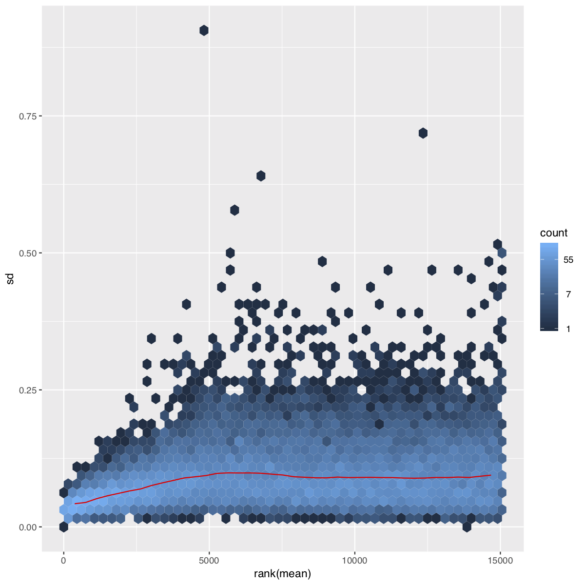
4. An exploratory plot of row standard deviations versus row means using the 'regularized log' transformation
    * 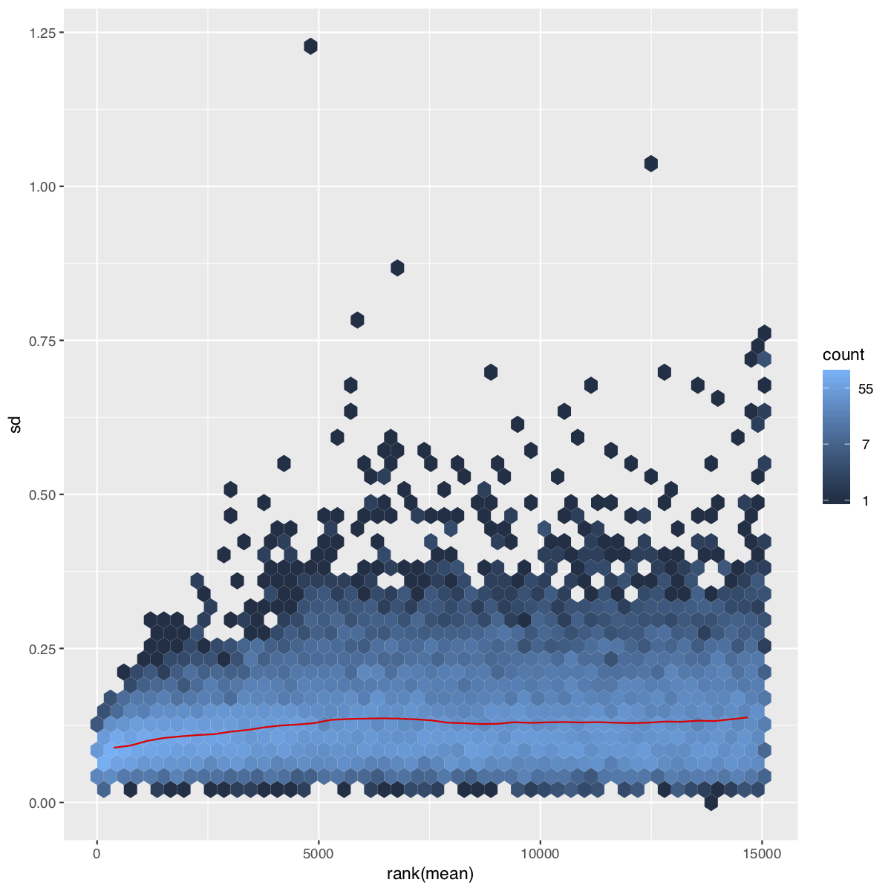
5. A MA plot of log2 fold changes (on the y-axis) versus the mean of normalized counts (on the x-axis)
    * 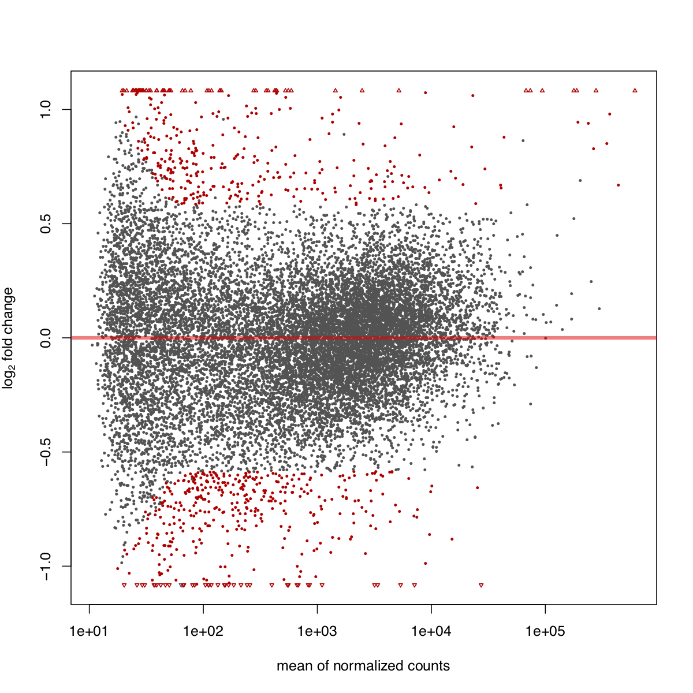
6. A scatter plot of log2 fold changes (on the y-axis) versus the FDR (on the x-axis)
    * 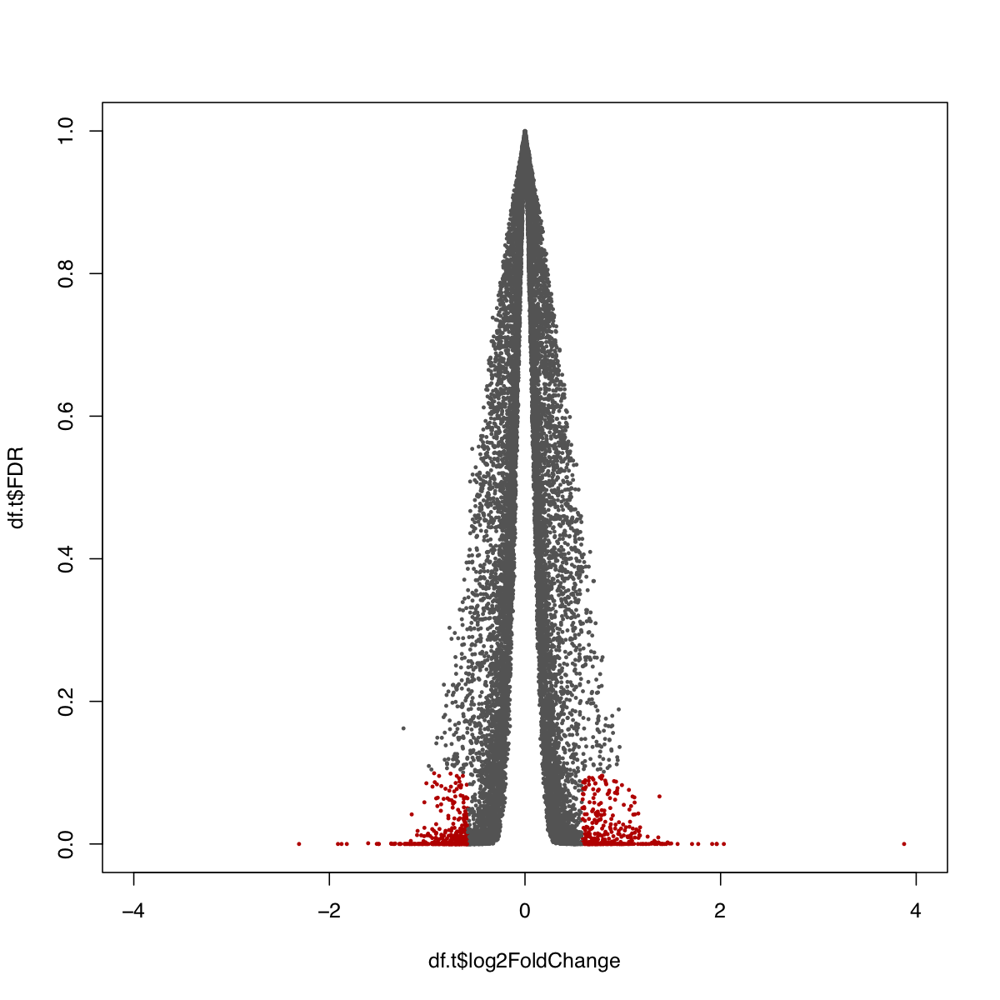


## **<span style="color:red">RUN AS PRACTICE</span>**

> 
> 
> To demonstrate the full power of the following analyses, the pipeline will use the pre-run count tables and DEG lists from the full sequencing datasets.  
> Please make sure that there is no any changes on the metadata file (i.e., <span style="color:red">```example/DLBC/DLBC.metadata.txt```</span>).  
> Otherwise, it will be considered as not running for practice and should expect the following results not be the same as shown here.  
> 
> 


### <a name="LociStat"/>Step 4-2: DEG Statistics | [Top](#Top)


In this step, the pipeline will collect DEG statistics and identify the overlapping set of identified DEGs from the previous methods.

The BDS code snippet for the sample KO01 will look like:


```bash
$ grep -A1 run.lociStat.featurecounts.star.DLBC.sh example/DLBC/Submit_RNAseq.DLBC.bds
dep( [ '/home/USER/cri_rnaseq/cri_rnaseq_2018/example/DLBC/RNAseq/LociStat/featurecounts/star/DLBC/DLBC.star.featurecounts.overlap.txt' ] <- [ '/home/USER/cri_rnaseq/cri_rnaseq_2018/example/DLBC_full/RNAseq/DEG/edger/featurecounts/star/DLBC.star.featurecounts.edger.test.DEG.txt', '/home/USER/cri_rnaseq/cri_rnaseq_2018/example/DLBC_full/RNAseq/DEG/deseq2/featurecounts/star/DLBC.star.featurecounts.deseq2.test.DEG.txt', '/home/USER/cri_rnaseq/cri_rnaseq_2018/example/DLBC_full/RNAseq/DEG/limma/featurecounts/star/DLBC.star.featurecounts.limma.test.DEG.txt' ], cpus := 4, mem := 32*G, timeout := 72*hour, taskName := "lociStat.featurecounts.star.DLBC") sys bash /home/USER/cri_rnaseq/cri_rnaseq_2018/example/DLBC/RNAseq/shell_scripts/run.lociStat.featurecounts.star.DLBC.sh; sleep 2
goal( [ '/home/USER/cri_rnaseq/cri_rnaseq_2018/example/DLBC/RNAseq/LociStat/featurecounts/star/DLBC/DLBC.star.featurecounts.overlap.txt' ] )
```

This code chunk will invoke the bash script (e.g., example/DLBC/RNAseq/shell_scripts/**`run.lociStat.featurecounts.star.DLBC.sh`**) to collect DEG statistics and to make a Venn diagram plot.

After the completion of the entire pipeline, you can check the statistics result of DEGs per method; for instance, the example dataset DLBC will be as follows.


```bash
$ grep -A5 'Up/Down regulated DEGs per methods' example/DLBC/RNAseq/LociStat/featurecounts/star/DLBC/run.lociStat.featurecounts.star.DLBC.log | tail -n+2
INFO [2018-07-25 15:18:08] #STAT:	 Up/Down regulated DEGs per methods
    edger deseq2 limma
-1    484    409   408
0       0      0     0
1     387    362   395
Sum   871    771   803
```


```bash
$ cut -f1,2,4 example/DLBC/RNAseq/LociStat/featurecounts/star/DLBC/DLBC.star.featurecounts.VennList.txt
```

<div style="border: 1px solid #ddd; padding: 5px; overflow-y: scroll; height:300px; overflow-x: scroll; width:100%; "><table class="table table-striped table-hover table-condensed table-responsive" style="margin-left: auto; margin-right: auto;">
<caption>DEG Statistics</caption>
 <thead>
  <tr>
   <th style="text-align:left;"> Methods </th>
   <th style="text-align:right;"> Method.Num </th>
   <th style="text-align:right;"> ID.Num </th>
  </tr>
 </thead>
<tbody>
  <tr>
   <td style="text-align:left;"> edger </td>
   <td style="text-align:right;"> 1 </td>
   <td style="text-align:right;"> 40 </td>
  </tr>
  <tr>
   <td style="text-align:left;"> deseq2 </td>
   <td style="text-align:right;"> 1 </td>
   <td style="text-align:right;"> 14 </td>
  </tr>
  <tr>
   <td style="text-align:left;"> limma </td>
   <td style="text-align:right;"> 1 </td>
   <td style="text-align:right;"> 45 </td>
  </tr>
  <tr>
   <td style="text-align:left;"> edger&amp;deseq2 </td>
   <td style="text-align:right;"> 2 </td>
   <td style="text-align:right;"> 85 </td>
  </tr>
  <tr>
   <td style="text-align:left;"> edger&amp;limma </td>
   <td style="text-align:right;"> 2 </td>
   <td style="text-align:right;"> 86 </td>
  </tr>
  <tr>
   <td style="text-align:left;"> deseq2&amp;limma </td>
   <td style="text-align:right;"> 2 </td>
   <td style="text-align:right;"> 12 </td>
  </tr>
  <tr>
   <td style="text-align:left;"> edger&amp;deseq2&amp;limma </td>
   <td style="text-align:right;"> 3 </td>
   <td style="text-align:right;"> 660 </td>
  </tr>
</tbody>
</table></div>


There is a Venn diagram plot will be generated after this step.

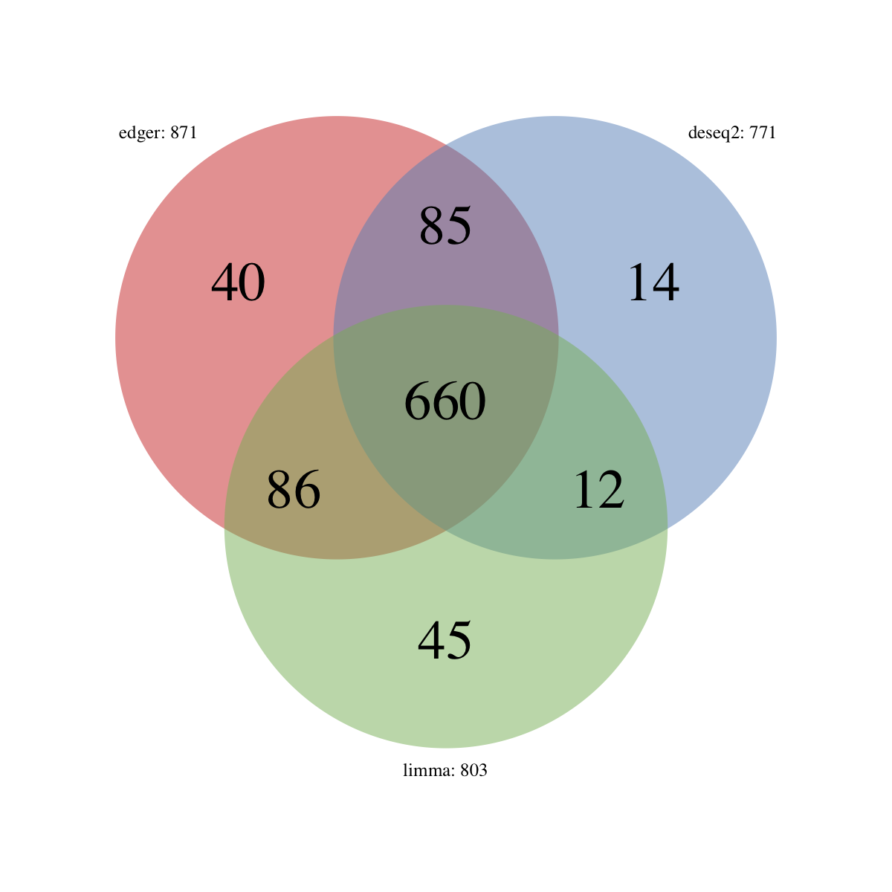


### <a name="QuantQC"/>Step 5: Sample Correlation | [Top](#Top)


In this step, the pipeline will make a PCA plot based on the transcriptional profiling of all samples.

The BDS code snippet for the sample KO01 will look like:


```bash
$ grep -A1 run.quantQC.pca.featurecounts.star.DLBC.sh example/DLBC/Submit_RNAseq.DLBC.bds
dep( [ '/home/USER/cri_rnaseq/cri_rnaseq_2018/example/DLBC/RNAseq/QuantQC/featurecounts/star/DLBC.star.featurecounts.pca.pdf' ] <- [ '/home/USER/cri_rnaseq/cri_rnaseq_2018/example/DLBC_full/RNAseq/DEG/deseq2/featurecounts/star/DLBC.star.featurecounts.deseq2.count.txt' ], cpus := 4, mem := 32*G, timeout := 72*hour, taskName := "pca.featurecounts.star.DLBC") sys bash /home/USER/cri_rnaseq/cri_rnaseq_2018/example/DLBC/RNAseq/shell_scripts/run.quantQC.pca.featurecounts.star.DLBC.sh; sleep 2
goal( [ '/home/USER/cri_rnaseq/cri_rnaseq_2018/example/DLBC/RNAseq/QuantQC/featurecounts/star/DLBC.star.featurecounts.pca.pdf' ] )
```

This code chunk will invoke the bash script (e.g., example/DLBC/RNAseq/shell_scripts/**`run.quantQC.pca.featurecounts.star.DLBC.sh`**) to make a PCA plot based on the alignment quantification result generated by DESeq2 or one of DE analysis tools.

After the completion of the entire pipeline, you can check the PCA plot under the folder of `QuantQC/`.

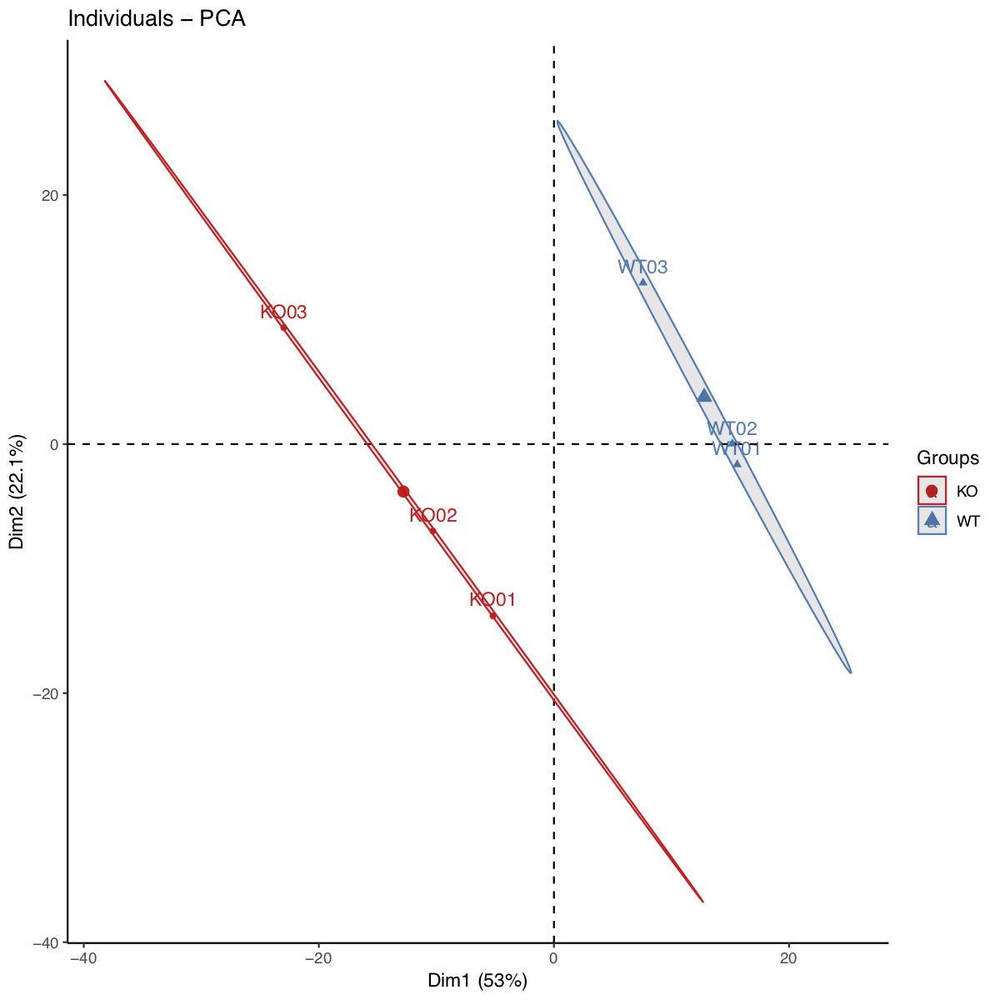


### <a name="HeatMap"/>Step 6: Heat Map | [Top](#Top)


In this step, the pipeline will make a heat map based on the overlapping set of DEGs identified across different DE analysis tools.

The BDS code snippet for the sample KO01 will look like:


```bash
$ grep -A1 run.postAna.pheatmap.featurecounts.star.DLBC.sh example/DLBC/Submit_RNAseq.DLBC.bds
dep( [ '/home/USER/cri_rnaseq/cri_rnaseq_2018/example/DLBC/RNAseq/PostAna/pheatmap/featurecounts/star/DLBC/DLBC.star.featurecounts.heatmap.pdf' ] <- [ '/home/USER/cri_rnaseq/cri_rnaseq_2018/example/DLBC/RNAseq/LociStat/featurecounts/star/DLBC/DLBC.star.featurecounts.overlap.txt' ], cpus := 1, mem := 8*G, timeout := 72*hour, taskName := "postAna.pheatmap.featurecounts.star.DLBC") sys bash /home/USER/cri_rnaseq/cri_rnaseq_2018/example/DLBC/RNAseq/shell_scripts/run.postAna.pheatmap.featurecounts.star.DLBC.sh; sleep 2
goal( [ '/home/USER/cri_rnaseq/cri_rnaseq_2018/example/DLBC/RNAseq/PostAna/pheatmap/featurecounts/star/DLBC/DLBC.star.featurecounts.heatmap.pdf' ] )
```

This code chunk will invoke the bash script (e.g., example/DLBC/RNAseq/shell_scripts/**`run.postAna.pheatmap.featurecounts.star.DLBC.sh`**) to make a heat map plot based on the overlapping set of DEGs identified across different DE analysis tools (i.e., [edgeR](https://bioconductor.org/packages/release/bioc/html/edgeR.html), [DESeq2](https://bioconductor.org/packages/release/bioc/html/DESeq2.html), and [limma](https://bioconductor.org/packages/release/bioc/html/limma.html)).

After the completion of the entire pipeline, you can check the heat map under the folder of `PostAna/pheatmap`.

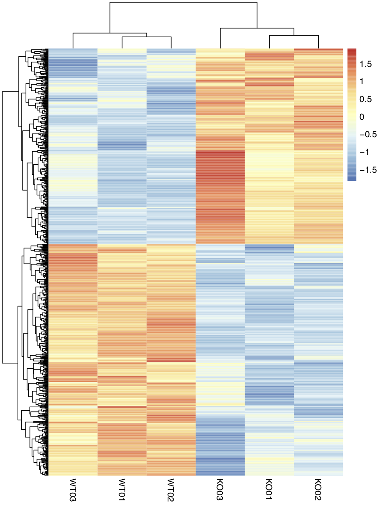


### <a name="GSEA"/>Step 7: Functional Enrichment Analysis | [Top](#Top)


In this step, the pipeline will conduct enrichment analysis and make several exploratory plots based on the overlapping set of DEGs identified across different DE analysis tools.

The BDS code snippet for the sample KO01 will look like:


```bash
$ grep -A1 run.postAna.clusterprofiler.featurecounts.star.DLBC.sh example/DLBC/Submit_RNAseq.DLBC.bds
dep( [ '/home/USER/cri_rnaseq/cri_rnaseq_2018/example/DLBC/RNAseq/PostAna/clusterprofiler/featurecounts/star/DLBC/DLBC.star.featurecounts.enrichGO.ALL.txt' ] <- [ '/home/USER/cri_rnaseq/cri_rnaseq_2018/example/DLBC/RNAseq/LociStat/featurecounts/star/DLBC/DLBC.star.featurecounts.overlap.txt' ], cpus := 1, mem := 8*G, timeout := 72*hour, taskName := "postAna.clusterprofiler.featurecounts.star.DLBC") sys bash /home/USER/cri_rnaseq/cri_rnaseq_2018/example/DLBC/RNAseq/shell_scripts/run.postAna.clusterprofiler.featurecounts.star.DLBC.sh; sleep 2
goal( [ '/home/USER/cri_rnaseq/cri_rnaseq_2018/example/DLBC/RNAseq/PostAna/clusterprofiler/featurecounts/star/DLBC/DLBC.star.featurecounts.enrichGO.ALL.txt' ] )
```

This code chunk will invoke the bash script (e.g., example/DLBC/RNAseq/shell_scripts/**`run.postAna.clusterprofiler.featurecounts.star.DLBC.shh`**) to conduct enrichment analyses including [GO](http://www.geneontology.org/) and [KEGG](https://www.genome.jp/kegg/) pathway erichment analyses as well as gene set enrichment analysis (GSEA).

After the completion of the entire pipeline, you can check the heat map under the folder of `PostAna/pheatmap`.


```bash
$ ls example/DLBC/RNAseq/PostAna/clusterprofiler/featurecounts/star/DLBC/
DLBC.star.featurecounts.enrichGO.ALL.cnetplot.pdf    DLBC.star.featurecounts.enrichGSEAGO.ALL.neg001.pdf  DLBC.star.featurecounts.enrichKEGG.cnetplot.pdf
DLBC.star.featurecounts.enrichGO.ALL.dotplot.pdf     DLBC.star.featurecounts.enrichGSEAGO.ALL.pos001.pdf  DLBC.star.featurecounts.enrichKEGG.dotplot.pdf
DLBC.star.featurecounts.enrichGO.ALL.emapplot.pdf    DLBC.star.featurecounts.enrichGSEAGO.ALL.txt         DLBC.star.featurecounts.enrichKEGG.emapplot.pdf
DLBC.star.featurecounts.enrichGO.ALL.txt             DLBC.star.featurecounts.enrichGSEAKEGG.pos001.pdf    DLBC.star.featurecounts.enrichKEGG.txt      run.GSEA.featurecounts.star.DLBC.log
```

Below, several plots will be generated based on the overlapping set of DEGs using [GO](http://www.geneontology.org/) database as an example.

1. An exploratory dot plot for enrichment result
    * 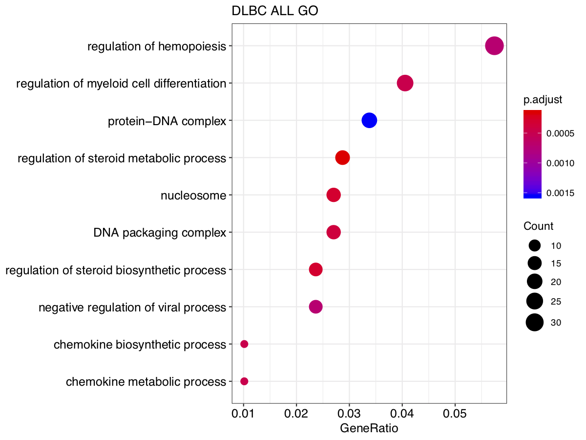
2. An exploratory enrichment map for enrichment result of over-representation test
    * 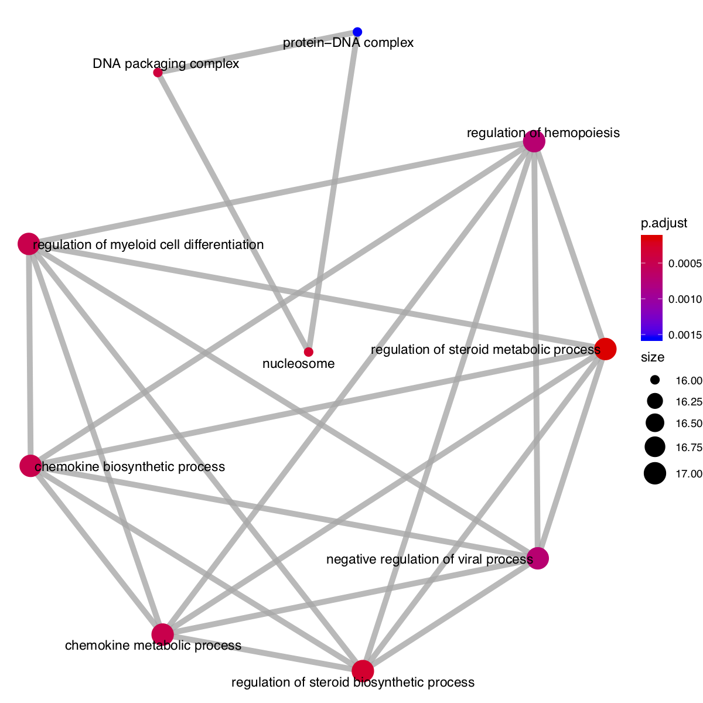
3. An exploratory Gene-Concept Network plot of over-representation test
    * 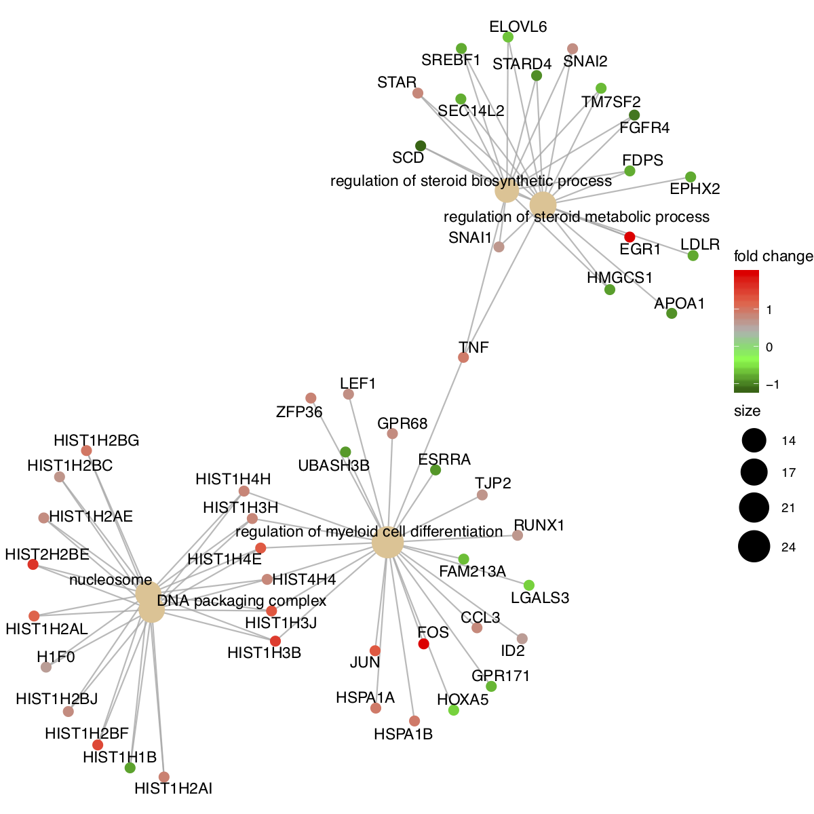
4. An exploratory plot of GSEA result with NES great than zero
    * 
5. An exploratory plot of GSEA result with NES less than zero
    * 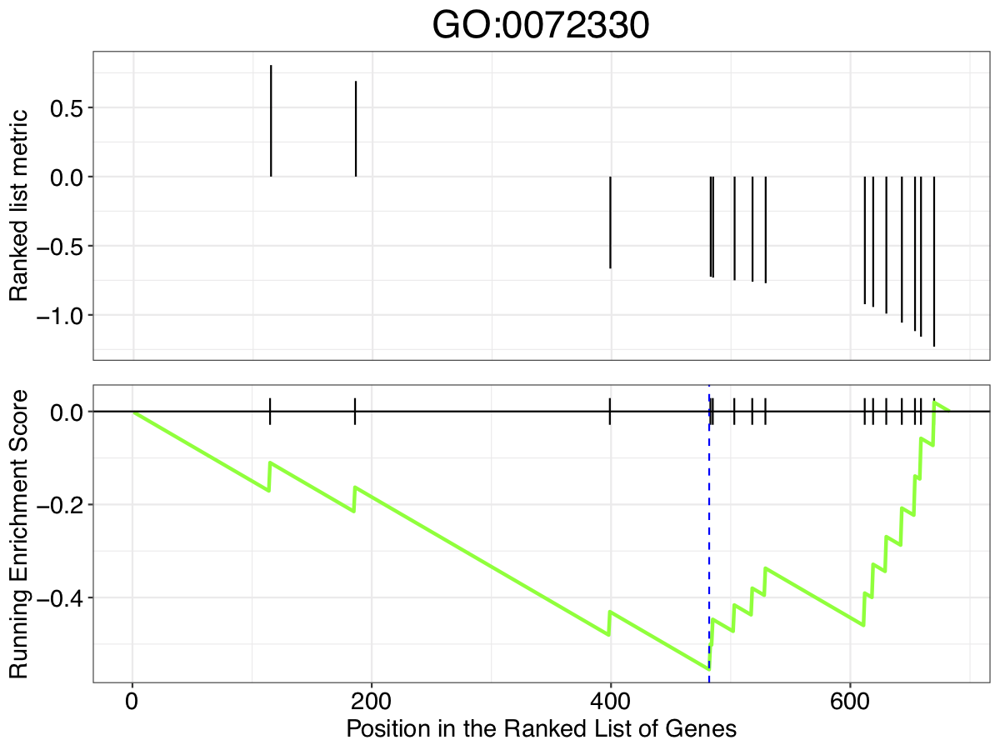


## <a name="BDS"/>BigDataScript Report | [Top](#Top)


Considering the environment setting in the CRI HPC system, [BigDataScript](https://pcingola.github.io/BigDataScript/) was used as a job management system in the current development to achieve an automatic pipeline. It can handle the execution dependency of all sub-task bash scripts and resume from a failed point, if any.

After the completion of the entire pipeline, you will see a BigDataScript report in HTML under the pipeline folder. For instance, this is the report from one test run. The graphic timeline will tell you the execution time per sub-task script.

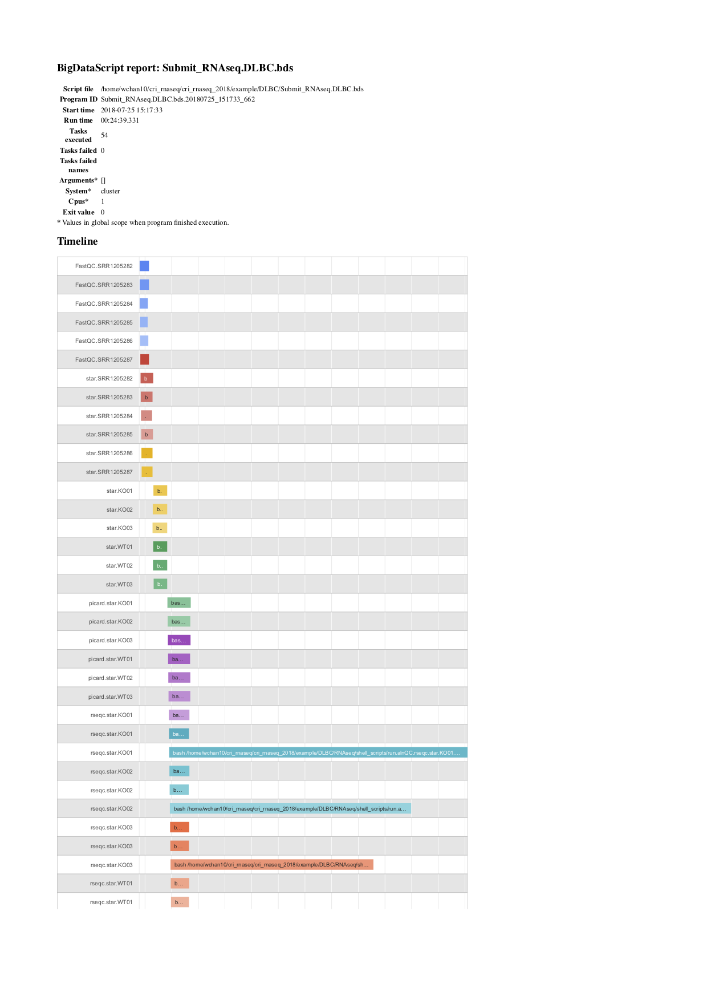


## <a name="Ref"/>Reference | [Top](#Top)


TBC
